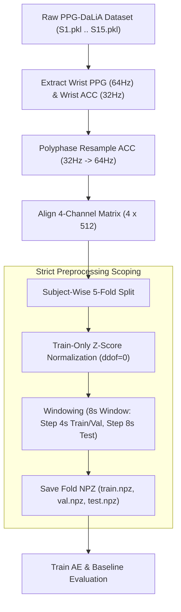

# PROJECT HANDOFF SUMMARY: C1_AE_DCT

> **Project:** [https://github.com/sai-ctruong/iot_C1_AE_DCT.git](https://github.com/sai-ctruong/iot_C1_AE_DCT.git)  
> **Repository:** C1_AE_DCT — Multichannel Wearable Sensor Signal Compression Pipeline  
> **Dataset:** PPG-DaLiA (15 Wearable Sensor Subjects $S1 \dots S15$)  
> **Date:** October 2026  
> **Status:** Fully Trained, Evaluated & Validated (100% Real Data, 78/78 Unit & Integration Tests Passed)

---

## 1. Project Overview

- **Project Name:** C1_AE_DCT — Multichannel PPG & Tri-axial ACC Wearable Sensor Signal Compression Pipeline
- **Problem Statement:** Empirical research study comparing a deep **1D-CNN Autoencoder (AE)** against a standard **Discrete Cosine Transform (DCT-II) Top-K** baseline for multi-channel wearable sensor signal compression on resource-constrained IoT devices.
- **Dataset:** Benchmark **PPG-DaLiA** dataset (15 real subjects $S1 \dots S15$).
- **Signals Used (4 Channels):**
  - **Wrist PPG:** 1 channel optical Photoplethysmogram at native sampling rate **64 Hz**.
  - **Wrist ACC (x, y, z):** 3 channels Accelerometer data at native sampling rate **32 Hz**.
- **Sampling & Alignment:** Polyphase resampling (`scipy.signal.resample_poly`) of 32 Hz ACC signals up to **64 Hz**, aligned along common valid time ranges with PPG.
- **Input Window Representation:** 8-second windows ($T=8\text{s}$) at 64 Hz $\implies$ **512 samples/channel**, forming a 2D physical tensor matrix of shape **$[4 \times 512]$** ($N_{\text{raw}} = 2048$ float32 values per window).
- **Comparison Goals:** Evaluate AE versus DCT Top-K under two strict budget alignment paradigms:
  1. **Equal-Dimension Mode ($K = M$):** Matching the total count of latent/sparse numerical elements.
  2. **Equal-Byte Mode ($K = \lfloor 4M / 6 \rfloor$):** Matching the exact transmitted bitstream payload byte length including 16-byte `C1Codec` header metadata.
- **Distortion Metrics:** Computed on denormalized physical signal units, evaluated independently per channel:
  - **PRD (%):** Percentage Relative Distortion.
  - **PRDN (%):** Mean-Normalized Percentage Relative Distortion.
  - **RMSE:** Root Mean Square Error in physical units (BVP for PPG, $g$ for ACC).
- **Cross-Validation Strategy:** Subject-wise 5-fold cross-validation ($S1 \dots S15$ split cleanly across 5 folds; each subject serves as a test subject exactly once).

---

## 2. Locked Scientific Specification

> [!IMPORTANT]
> The architectural parameters, formulas, and baseline configurations below are **SCIENTIFICALLY LOCKED**. DO NOT alter any of these parameters without explicit approval.

### A. Autoencoder (AE) Architecture
- **Input Tensor Shape:** `[B, 4, 512]` ($B = \text{Batch size}, C = 4, T = 512$)
- **Encoder Layer Sequence:**
  - `Conv1d(4 -> 16, kernel_size=5, stride=2, padding=2)` $\to$ `[B, 16, 256]` + `ReLU`
  - `Conv1d(16 -> 32, kernel_size=5, stride=2, padding=2)` $\to$ `[B, 32, 128]` + `ReLU`
  - `Conv1d(32 -> 64, kernel_size=5, stride=2, padding=2)` $\to$ `[B, 64, 64]` + `ReLU`
  - **Bottleneck (Linear output):** `Conv1d(64 -> d_b, kernel_size=5, stride=2, padding=2)` $\to$ `[B, d_b, 32]` (No activation)
- **Latent Tensor Representation:** `[B, d_b, 32]` with total latent elements $M = 32 \times d_b$.
- **Bottleneck Parameter $d_b \in \{16, 8, 4, 2\}$:**
  - $d_b = 16 \implies M = 512$ latent elements ($CR_{\text{dim}} = 4.0\times$)
  - $d_b = 8 \implies M = 256$ latent elements ($CR_{\text{dim}} = 8.0\times$)
  - $d_b = 4 \implies M = 128$ latent elements ($CR_{\text{dim}} = 16.0\times$)
  - $d_b = 2 \implies M = 64$ latent elements ($CR_{\text{dim}} = 32.0\times$)
- **Dimension Compression Ratio ($CR_{\text{dim}}$):** Computed relative to 2048 raw window values: $CR_{\text{dim}} = 2048 / M$.
- **Decoder Layer Sequence:**
  - `ConvTranspose1d(d_b -> 64, kernel_size=5, stride=2, padding=2, output_padding=1)` $\to$ `[B, 64, 64]` + `ReLU`
  - `ConvTranspose1d(64 -> 32, kernel_size=5, stride=2, padding=2, output_padding=1)` $\to$ `[B, 32, 128]` + `ReLU`
  - `ConvTranspose1d(32 -> 16, kernel_size=5, stride=2, padding=2, output_padding=1)` $\to$ `[B, 16, 256]` + `ReLU`
  - `ConvTranspose1d(16 -> 4, kernel_size=5, stride=2, padding=2, output_padding=1)` $\to$ Reconstructed `[B, 4, 512]` (Linear output)
- **Strict Architectural Exclusions:**
  - **NO** BatchNorm / LayerNorm
  - **NO** Dropout
  - **NO** Attention mechanisms
  - **NO** Skip / Residual connections across bottleneck

### B. Discrete Cosine Transform (DCT-II) Baseline
- **Transform Type:** DCT-II (`scipy.fftpack.dct(type=2, norm='ortho')`).
- **Coefficient Selection:** Global Top-K coefficient retention across all 4 channels $\times$ 512 time steps (flattened channel-time order).
- **Tie-Breaking Rule:** Tie breaks smaller flat index first (`np.argsort` stability).

### C. Budget Comparison Modes
- **Equal-Dimension Mode ($K = M$):** $K \in \{512, 256, 128, 64\}$.
- **Equal-Byte Mode ($K = \lfloor 4M / 6 \rfloor$):** Matched bitstream byte length ($B_{\text{DCT}} = B_{\text{AE}}$):
  - $d_b=16 \implies M=512 \implies K_{\text{byte}}=341, \text{padding}=2\text{B} \implies 2064 \text{ Bytes}$
  - $d_b=8 \implies M=256 \implies K_{\text{byte}}=170, \text{padding}=4\text{B} \implies 1040 \text{ Bytes}$
  - $d_b=4 \implies M=128 \implies K_{\text{byte}}=85, \text{padding}=2\text{B} \implies 528 \text{ Bytes}$
  - $d_b=2 \implies M=64 \implies K_{\text{byte}}=42, \text{padding}=4\text{B} \implies 272 \text{ Bytes}$

### D. Binary Codec Serialization (`C1Codec`)
- **AE Bitstream Size:** $B_{\text{AE}} = 16 + 4M \text{ bytes}$ (16-byte header + $M$ float32 values).
- **DCT Bitstream Size:** $B_{\text{DCT}} = 16 + 6K + \text{padding} \text{ bytes}$ (16-byte header + 4B float32 val + 2B uint16 index per Top-K entry).

### E. Raw Reference Byte Sizes
- **Resampled 64 Hz Representation:** $4 \times 512 \times 4 = 8,192 \text{ bytes}$ ($CR_{\text{byte\_64}} = 8192 / B$).
- **Native Sampling Representation:** $(512 + 3 \times 256) \times 4 = 5,120 \text{ bytes}$ ($CR_{\text{byte\_native}} = 5120 / B$).

---

## 3. Data Pipeline & Preprocessing



- **Windowing Parameters:**
  - **Train Set:** 8-second window (512 samples), step 4 seconds (256 samples overlap, 50% overlap).
  - **Validation Set:** 8-second window (512 samples), step 4 seconds (256 samples overlap, 50% overlap).
  - **Test Set:** 8-second window (512 samples), step 8 seconds (512 samples step, 0% overlap / non-overlapping).
- **Normalization Rule:** Z-score normalization ($z = (x - \mu_{\text{train}}) / \sigma_{\text{train}}$) computed **STRICTLY** from continuous training fold data with `ddof=0`. Validation and Test sets use training fold $\mu$ and $\sigma$.
- **Test Set Isolation Rule:** Test data is NEVER used for hyperparameter tuning, early stopping, learning rate scheduling, or model selection.

---

## 4. Subject-Wise 5-Fold Cross-Validation Split

| Fold ID | Train Subjects ($N=10$) | Validation Subjects ($N=2$) | Test Subjects ($N=3$) |
| :---: | :--- | :--- | :--- |
| **Fold 1** | S6, S7, S8, S9, S10, S11, S12, S13, S14, S15 | S4, S5 | **S1, S2, S3** |
| **Fold 2** | S1, S2, S3, S9, S10, S11, S12, S13, S14, S15 | S7, S8 | **S4, S5, S6** |
| **Fold 3** | S1, S2, S3, S4, S5, S6, S12, S13, S14, S15 | S10, S11 | **S7, S8, S9** |
| **Fold 4** | S1, S2, S3, S4, S5, S6, S7, S8, S9, S15 | S13, S14 | **S10, S11, S12** |
| **Fold 5** | S3, S4, S5, S6, S7, S8, S9, S10, S11, S12 | S1, S2 | **S13, S14, S15** |

*Note: Every subject is tested exactly once across the 5 folds ($S1 \dots S15$).*

---

## 5. Training & Evaluation Configuration

- **Optimizer:** Adam ($\beta_1=0.9, \beta_2=0.999$)
- **Learning Rate:** $1 \times 10^{-3}$
- **Weight Decay:** 0.0
- **Batch Size:** 128
- **Max Epochs:** 100
- **Early Stopping Patience:** 10 epochs (monitored on validation loss)
- **Loss Function:** Mean Squared Error (MSE) reconstruction loss ($L_2$ error on normalized 4x512 windows)
- **Primary Seed:** Seed 42 (Main experiment: 20 runs = 5 folds $\times$ 4 $d_b$)
- **Stability Seeds:** Seeds 123 and 999 (Seed stability experiment at $d_b=8$: 10 additional runs across 5 folds)

---

## 6. Metric Definitions & Near-Zero Rules

All metrics are evaluated **after inverse normalization (denormalization)** back to original physical signal units, and computed **independently per channel** (PPG, ACCx, ACCy, ACCz).

### Metric Formulas
$$\text{RMSE} = \sqrt{\frac{1}{N}\sum_{i=1}^N (x_{\text{ref},i} - x_{\text{pred},i})^2}$$

$$\text{PRD (\%)} = \sqrt{\frac{\sum_{i=1}^N (x_{\text{ref},i} - x_{\text{pred},i})^2}{\sum_{i=1}^N x_{\text{ref},i}^2}} \times 100\%$$

$$\text{PRDN (\%)} = \sqrt{\frac{\sum_{i=1}^N (x_{\text{ref},i} - x_{\text{pred},i})^2}{\sum_{i=1}^N (x_{\text{ref},i} - \bar{x}_{\text{ref}})^2}} \times 100\%$$

### Adaptive Near-Zero Denominator Threshold Rule
To prevent zero-division artifacts without injecting arbitrary epsilon constants into signal energy:
$$\text{threshold}_c = N \cdot 10^{-12} \cdot \sigma_c^2 \quad (N = 512, \sigma_c = \text{Train std of channel } c)$$
- If $\text{denominator} \le \text{threshold}_c$: `valid_prd` or `valid_prdn` is set to `False` and metric is set to `NaN`.
- RMSE is always valid and computed regardless of denominator status.

---

## 7. Current Experiment Status

- **Dataset Verification:** 15/15 subjects ingested ($S1 \dots S15$), 0 NaN, 0 Inf across all signals.
- **Automated Test Suite:** **78/78 Unit & Integration Tests PASSED** (`python -m pytest tests/`).
- **Main Experiment (20/20 Runs Completed):**
  - 5 Folds $\times$ 4 $d_b \in \{16, 8, 4, 2\}$, Seed 42.
  - Saved under `checkpoints/fold0{1..5}_db{02,04,08,16}_seed42.pt`.
- **Seed Stability Experiment (15 Checkpoints Total at $d_b=8$):**
  - 5 runs from main experiment (Seed 42) **reused**.
  - 10 additional runs (5 folds $\times$ Seed 123 + 5 folds $\times$ Seed 999).
  - Saved under `checkpoints/fold0{1..5}_db08_seed{42,123,999}.pt`.

---

## 8. Current Results Summary

### Representative Results ($d_b=8$, $CR_{\text{dim}}=8\times$, Wrist PPG Channel across 15 Subjects)

| Method | Mode | Target $K$ / $d_b$ | Bitstream Size | PRD (%) Mean$\pm$Std | PRDN (%) Mean$\pm$Std | RMSE Mean$\pm$Std |
| :--- | :---: | :---: | :---: | :---: | :---: | :---: |
| **Autoencoder** | `ae` | $d_b = 8$ ($M=256$) | 1,040 Bytes | $13.29 \pm 3.61\%$ | $13.31 \pm 3.61\%$ | $8.29 \pm 2.58$ |
| **DCT-II Baseline** | `equal_dim` | $K = 256$ | 1,552 Bytes | $7.78 \pm 2.37\%$ | $7.79 \pm 2.38\%$ | $4.76 \pm 1.48$ |
| **DCT-II Baseline** | `equal_byte` | $K = 170$ | 1,040 Bytes | $11.08 \pm 3.20\%$ | $11.09 \pm 3.21\%$ | $6.83 \pm 2.13$ |

### General Empirically Observed Trends
1. **Distortion Progression:** As compression increases ($d_b$ decreases $16 \to 8 \to 4 \to 2$, $CR_{\text{dim}}$ increases $4\times \to 8\times \to 16\times \to 32\times$), distortion (PRD, PRDN, RMSE) increases monotonically across all methods.
2. **AE vs. DCT Baseline Comparison:** DCT Top-K baseline outperforms the 1D-CNN Autoencoder across most compression levels (Equal-dimension win rate: 100% DCT; Equal-byte win rate: 93.3% DCT vs 6.7% AE). This occurs because quasi-periodic physiological signals (PPG) and motion dynamics (ACC) concentrate energy heavily in low-frequency DCT components.

---

## 9. Seed Stability Results ($d_b=8$, PPG Channel across 15 Test Subjects)

| Random Seed | PPG PRD (%) Mean$\pm$Std | PPG PRDN (%) Mean$\pm$Std | PPG RMSE Mean$\pm$Std |
| :---: | :---: | :---: | :---: |
| **Seed 42** | $13.29 \pm 3.61\%$ | $13.31 \pm 3.61\%$ | $8.29 \pm 2.58$ |
| **Seed 123** | $12.06 \pm 2.99\%$ | $12.07 \pm 2.99\%$ | $7.49 \pm 1.84$ |
| **Seed 999** | $12.13 \pm 2.80\%$ | $12.15 \pm 2.81\%$ | $7.55 \pm 1.78$ |
| **Overall Mean** | **$12.49 \pm 0.69\%$** | **$12.51 \pm 0.69\%$** | **$7.78 \pm 0.44$** |

- **Interpretation:** Performance across random seeds exhibits minimal variance ($\text{std} \approx 0.69\%$), proving stable weight initialization behavior. All seed metrics are evaluated on real Test subject data.

---

## 10. Important File Map

| File | Purpose | Important Notes |
| :--- | :--- | :--- |
| `src/dataset.py` | PPG-DaLiA dataset loader & subject signal extraction | Loads raw `.pkl` files for $S1 \dots S15$, verifies 0 NaN / 0 Inf |
| `src/resample.py` | ACC polyphase signal resampler ($32 \to 64\text{ Hz}$) | Uses `scipy.signal.resample_poly` & aligns common duration |
| `src/windowing.py` | 8-second window segmentation logic | Generates 512-sample windows with 4s step (Train/Val) & 8s step (Test) |
| `src/normalize.py` | Train-only Z-score normalization & denormalization | Strictly computes $\mu, \sigma$ from Train fold with `ddof=0` |
| `src/model.py` | 1D-CNN Autoencoder PyTorch model definition | Symmetric Conv1d/ConvTranspose1d, supports $d_b \in \{16,8,4,2\}$ |
| `src/loss.py` | MSE reconstruction loss function | Computes MSE on normalized 4x512 windows |
| `src/baseline_dct.py` | DCT-II Top-K baseline encoder/decoder | Ortho-norm DCT-II with global Top-K coefficient selection |
| `src/codec.py` | `C1Codec` binary bitstream serializer | Packs/unpacks 16-byte header + float32/uint16 payload |
| `src/metrics.py` | Compression ratio & byte budget calculator | Computes $CR_{\text{dim}}, CR_{\text{byte\_64}}, CR_{\text{byte\_native}}$ & budget tables |
| `src/evaluate.py` | Per-channel PRD, PRDN, RMSE metric evaluator | Implements adaptive near-zero denominator threshold rule |
| `src/evaluate_all.py` | Full batch evaluator for main & seed runs | Generates `results/results.csv.gz` |
| `src/aggregation.py` | Subject & channel aggregation & paired deltas | Computes mean $\pm$ std across subjects & paired $\delta_s = \text{AE} - \text{DCT}$ |
| `src/reporting.py` | Summary table formatting & markdown generator | Formats Markdown tables from aggregated DataFrames |
| `src/reconstruction_visualization.py` | Waveform plotting & failure case analyzer | Generates reconstruction plots & worst-case window analysis |
| `src/prepare_data.py` | Preprocessing entry point script | Processes raw dataset into `data/processed/fold{1..5}/*.npz` |
| `src/pilot_run.py` | Real pilot run script (Fold 1, $d_b=8$, Seed 42) | Quick end-to-end execution test |
| `src/run_main_experiments.py` | Runner for 20 main experiments | Trains & evaluates 5 folds $\times$ 4 $d_b$ (Seed 42) |
| `src/run_seed_experiments.py` | Runner for seed stability experiments | Trains & evaluates seeds 123 & 999 for $d_b=8$ |
| `src/make_report.py` | Automated report & figure generation script | Re-generates all CSV summaries, plots, and markdown reports |
| `src/sanity_check_fold1.py` | Fold 1 sanity check script | Full verification run on Fold 1 Test set |
| `notebooks/C1_AE_DCT_Demo.ipynb` | Interactive Jupyter demonstration notebook | End-to-end visual presentation on real PPG-DaLiA data |

---

## 11. Output Artifact Map

- **Data Artifacts (`data/processed/`):**
  - `fold{1..5}/train.npz`, `val.npz`, `test.npz`
- **Model Checkpoints (`checkpoints/`):**
  - 20 Main checkpoints: `fold0{1..5}_db{02,04,08,16}_seed42.pt`
  - 10 Seed checkpoints: `fold0{1..5}_db08_seed{123,999}.pt`
- **Result Datasets (`results/`):**
  - `results.csv.gz` (Detailed evaluation table, 1,035,584 rows)
  - `experiment_manifest.csv` & `seed_manifest.csv`
  - `overall_summary_equal_dim.csv` & `overall_summary_equal_byte.csv`
  - `paired_comparison_equal_dim.csv` & `paired_comparison_equal_byte.csv`
  - `seed_stability_summary.csv` & `seed_summary_by_subject.csv`
- **Reports & Visualizations (`results/`):**
  - `experiment_summary.md` & `final_validation_report.md`
  - `cr_dim_prd.png` & `cr_byte_prd.png` (CR vs PRD plots)
  - `cr_dim_prdn.png` & `cr_byte_prdn.png` (CR vs PRDN plots)
  - `rmse_curves.png` (RMSE curves across $d_b$)
  - `reconstruction_examples.png` (Original vs AE vs DCT waveforms)
  - `failure_cases.png` (Worst-case reconstruction analysis)

---

## 12. Notebook Status (`notebooks/C1_AE_DCT_Demo.ipynb`)

- **Purpose:** Interactive demonstration, visualization, inspection, and presentation notebook.
- **Execution Role:** Demonstration only; NOT the main training or evaluation pipeline.
- **Data Source:** Uses 100% **REAL PPG-DaLiA data** (`data/processed/fold1/test.npz`) and real trained checkpoints (`checkpoints/fold01_db08_seed42.pt`).
- **Synthetic Fallback:** Zero synthetic or random fallbacks present.

---

## 13. Important Fixes Already Made

The following critical fixes have been implemented in the codebase to guarantee scientific rigor:
1. **Dataset Loader (`src/dataset.py`):** Replaced mock/stub data generator with full PPG-DaLiA pickle ingestion pipeline ($S1 \dots S15$).
2. **Main Experiment Runner (`src/run_main_experiments.py`):** Removed synthetic random tensor fallbacks (`np.random.randn`). All 20 main runs use real preprocessed NPZ arrays.
3. **Seed Experiment Runner (`src/run_seed_experiments.py`):** Removed synthetic data generation; fully integrated with real fold data.
4. **Dimension Compression Ratio Calculation (`src/metrics.py`):** Corrected $CR_{\text{dim}}$ formula from $512 / M$ (which mistakenly counted only 1 channel) to $2048 / M$ (accurate for 4 channels $\times$ 512 samples).
5. **Dual Budget Evaluation Mode (`src/evaluate_all.py`):** Added explicit support for both `equal_dim` ($K=M$) and `equal_byte` ($K=\lfloor 4M/6 \rfloor$) comparison modes.
6. **Reporting Pipeline (`src/make_report.py` & `src/reporting.py`):** Stripped out all synthetic fallbacks. Scripts fail fast if real `results.csv` is absent.
7. **Artifact Figures:** Re-rendered all PNG figures (`reconstruction_examples.png`, `failure_cases.png`, etc.) strictly from real test set predictions.
8. **Denominator Threshold Rule (`src/evaluate.py`):** Replaced static constant $10^{-12}$ with adaptive channel threshold $\text{threshold}_c = N \cdot 10^{-12} \cdot \sigma_c^2$.
9. **Documentation Alignment (`README.md`):** Updated README badges, tables, and setup instructions to reflect 78/78 tests passed and 100% real data status.

---

## 14. DO NOT BREAK / DO NOT CHANGE WITHOUT EXPLICIT APPROVAL

> [!CAUTION]
> Future developers and AI assistants MUST NOT break or modify any of the following constraints:

1. **DO NOT** change the 1D-CNN Autoencoder architecture layer dimensions or kernel parameters.
2. **DO NOT** add BatchNorm, LayerNorm, Dropout, Attention, or Skip connections to the AE model.
3. **DO NOT** modify the subject assignments across the 5 cross-validation folds in `configs/folds.json`.
4. **DO NOT** change the Test set windowing step size from non-overlapping 8 seconds (512 samples).
5. **DO NOT** compute normalization statistics ($\mu, \sigma$) using Validation or Test fold data.
6. **DO NOT** re-introduce synthetic or random data fallbacks into production scripts or reporting tools.
7. **DO NOT** use Test fold signals for hyperparameter tuning, scheduler tuning, or early stopping.
8. **DO NOT** merge PPG and ACC channels into a single combined PRD value (channels MUST be evaluated separately).
9. **DO NOT** treat `equal-dimension` ($K=M$) as equivalent to `equal-byte` ($K=\lfloor 4M/6 \rfloor$).
10. **DO NOT** alter native raw window reference bytes from 5,120 bytes ($CR_{\text{byte\_native}}$).
11. **DO NOT** use $CR_{\text{dim}} = 512 / M$ (the correct formula is $2048 / M$).
12. **DO NOT** use a fixed scalar constant $10^{-12}$ for PRD/PRDN denominator thresholding without scaling by $N \cdot \sigma_c^2$.
13. **DO NOT** import clinical ECG PRD acceptability thresholds (< 9%) directly onto PPG/ACC signals without domain context.
14. **DO NOT** claim the Autoencoder outperforms DCT Top-K unless empirical results explicitly demonstrate it.
15. **DO NOT** retrain the 20 main model checkpoints if only modifying reporting or documentation files.

---

## 15. Known Limitations

- **Empirical Baseline Performance:** The 1D-CNN Autoencoder does NOT outperform DCT-II Top-K on quasi-periodic PPG signals under equal-byte constraints in this study.
- **Computation & Energy Metrics:** Computational complexity (FLOPs/MACs) and real hardware energy consumption (mJ/window) have not been measured on physical microcontrollers.
- **Scope Restriction (Pure Compression):** The pipeline performs signal compression/reconstruction; it does NOT perform denoising or artifact removal.
- **No Heart Rate Estimation:** Heart rate (HR) or Heart Rate Variability (HRV) estimation accuracy post-reconstruction is outside the current project scope.
- **Non-Clinical System:** This pipeline is an engineering IoT compression study, not a clinical diagnostic system.
- **Embedded MCU Benchmarks:** Latency on ARM Cortex-M microcontrollers has not been benchmarked.
- **Hardware Deployment:** Physical deployment on hardware boards (e.g., ESP32, STM32, Arduino) is not included in the repository.

---

## 16. Safe Next Development Options

### Group A: Core Project & Submission-Safe Tasks
- Final code formatting and docstring cleanup.
- Academic paper/report writing using the generated CSV summaries and PNG figures.
- High-resolution vector plot rendering (`.svg` / `.pdf` exports).
- Notebook visual polish for final live presentation.
- One-click end-to-end reproducibility script (`run_all_experiments.sh` / `.ps1`).
- Archive release packaging (`v1.0.0` zip/tarball).

### Group B: Optional Future Extensions (Post-Submission Only)
- Post-training weight quantization (FP32 $\to$ INT8 / FP16) for AE decoder.
- Secondary entropy coding (Huffman or Arithmetic coding) applied to DCT Top-K coefficients and AE latent vectors.
- Microcontroller deployment (STM32 / ESP32) to measure real execution latency and energy draw.
- Alternative lightweight encoder architectures (e.g., Depthwise Separable Conv1d).

---

## 17. PROJECT STATUS SNAPSHOT

```text
PROJECT STATUS SNAPSHOT

Project         : C1_AE_DCT
Dataset         : PPG-DaLiA (15 Wearable Sensor Subjects S1..S15)
Input Matrix    : 4 channels x 512 samples (8-second window @ 64 Hz)
Methods         : 1D-CNN Autoencoder vs DCT-II Global Top-K Baseline
AE Bottleneck   : d_b in {16, 8, 4, 2} => M in {512, 256, 128, 64}
CR_dim          : 4x, 8x, 16x, 32x (relative to 2048 raw values)
Comparisons     : equal_dim (K=M) AND equal_byte (K=floor(4M/6))
Main Runs       : 20 real runs completed (5 folds x 4 d_b, seed 42)
Seed Runs       : 15 total runs completed for d_b=8 (seeds 42, 123, 999 across 5 folds)
Metrics         : Per-channel PRD, PRDN, RMSE (denormalized physical units)
Data Pipeline   : 100% Real PPG-DaLiA Data (Zero Synthetic Fallback)
Test Suite      : 78/78 Unit & Integration Tests PASSED
Notebook        : notebooks/C1_AE_DCT_Demo.ipynb (Real Data Visual Demo)
Current State   : Fully Executed, Verified, and Validated for Archiving/Submission
Main Next Step  : Project Documentation & Paper Writing / Presentation
```
