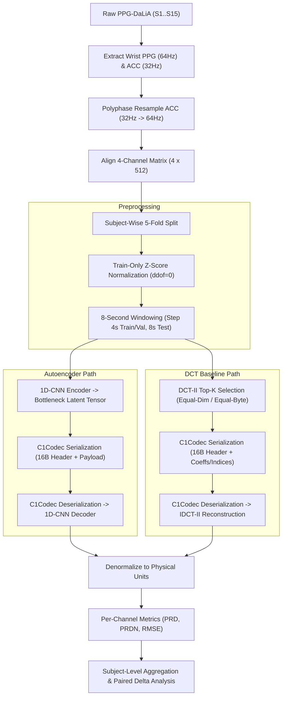

# C1_AE_DCT
### 1D-CNN Autoencoder vs. DCT-II for Wearable Sensor Signal Compression


---

## Overview

This project presents an empirical research study comparing a deep **1D-CNN Autoencoder (AE)** against a standard **Discrete Cosine Transform (DCT-II) Top-K** baseline for multi-channel wearable sensor signal compression. The pipeline processes raw optical photoplethysmography (**Wrist PPG @ 64 Hz**) and 3-axis accelerometer (**Wrist ACCx/y/z @ 32 Hz**) data from the benchmark **PPG-DaLiA** dataset. Accelerometer signals are polyphase-resampled to 64 Hz, segmented into 8-second windows ($4 \times 512$ physical matrix), normalized strictly using training-fold statistics, and evaluated under two distinct budget constraints (**equal-dimension** and **equal-byte** payload alignment) across 15 real test subjects using PRD, PRDN, and RMSE distortion metrics.

---

## Project Overview

| Item | Setting |
| :--- | :--- |
| **Dataset** | PPG-DaLiA (Real Wearable Sensors, 15 Subjects $S1 \dots S15$) |
| **Signals** | 4 Channels: Wrist PPG (1 ch) + Wrist ACCx, ACCy, ACCz (3 ch) |
| **Sampling & Alignment** | PPG @ 64 Hz, ACC @ 32 Hz $\to$ Polyphase resample ACC to 64 Hz |
| **Input Matrix** | $4 \text{ channels} \times 512 \text{ samples}$ per 8-second window ($N_{\text{raw}} = 2048$) |
| **Cross-Validation** | Subject-wise 5-fold CV ($S1..S3 \to \text{F1}$, $S4..S6 \to \text{F2}$, $S7..S9 \to \text{F3}$, $S10..S12 \to \text{F4}$, $S13..S15 \to \text{F5}$) |
| **AE Bottleneck ($d_b$)** | $d_b \in \{16, 8, 4, 2\} \implies \text{Latent dimension } M \in \{512, 256, 128, 64\}$ |
| **Dimension CR ($CR_{\text{dim}}$)** | $4\times, 8\times, 16\times, 32\times$ relative to 2048 raw values |
| **Baseline** | Discrete Cosine Transform (DCT-II) Global Top-K ($K_{\text{equal\_dim}}$ and $K_{\text{equal\_byte}}$) |
| **Distortion Metrics** | PRD (%), PRDN (%), RMSE in original physical signal units |

---

## Architecture

### End-to-End Processing Pipeline



### 1D-CNN Autoencoder Model

The neural compression model uses a symmetric 1D convolutional architecture without auxiliary regularization layers (no BatchNorm, Dropout, Attention, or Skip connections):

```text
Input Window: [Batch, 4 channels, 512 samples]
│
├── Encoder:
│   ├── Conv1d(4 -> 16,  kernel=5, stride=2, padding=2)  -> [B, 16, 256] + LeakyReLU(0.2)
│   ├── Conv1d(16 -> 32, kernel=5, stride=2, padding=2)  -> [B, 32, 128] + LeakyReLU(0.2)
│   ├── Conv1d(32 -> 64, kernel=5, stride=2, padding=2)  -> [B, 64, 64]  + LeakyReLU(0.2)
│   └── Linear(64 -> d_b) per time step                  -> Latent Tensor [B, d_b, 32] (M = 32 * d_b)
│
└── Decoder:
    ├── Linear(d_b -> 64) per time step                  -> Reshaped [B, 64, 64] + LeakyReLU(0.2)
    ├── ConvTranspose1d(64 -> 32, k=5, s=2, p=2, out_p=1) -> [B, 32, 128] + LeakyReLU(0.2)
    ├── ConvTranspose1d(32 -> 16, k=5, s=2, p=2, out_p=1) -> [B, 16, 256] + LeakyReLU(0.2)
    └── ConvTranspose1d(16 -> 4,  k=5, s=2, p=2, out_p=1) -> Reconstructed Output [B, 4, 512]
```

---

## Compression Settings & Budget Allocation

To ensure rigorous baseline comparison, DCT Top-K is evaluated under two distinct budget modes:
1. **Equal-Dimension Mode ($K = M$):** Matches the exact number of numerical elements.
2. **Equal-Byte Mode ($K = \lfloor 4M / 6 \rfloor$):** Matches the exact transmitted bitstream byte length including header metadata.

| $d_b$ | Latent Elements ($M$) | AE $CR_{\text{dim}}$ | DCT $K$ (Equal-Dim) | DCT $K$ (Equal-Byte) | Bitstream Payload Size ($B_{\text{AE}} = B_{\text{DCT}}$) |
| :---: | :---: | :---: | :---: | :---: | :---: |
| **16** | 512 | $4.0\times$ | 512 | 341 | **2,064 Bytes** |
| **8** | 256 | $8.0\times$ | 256 | 170 | **1,040 Bytes** |
| **4** | 128 | $16.0\times$ | 128 | 85 | **528 Bytes** |
| **2** | 64 | $32.0\times$ | 64 | 42 | **272 Bytes** |

### Byte Budget Formulas
- **AE Bitstream Size:** $B_{\text{AE}} = 16 + 4M \text{ bytes}$ (16-byte C1Codec header + float32 latent values).
- **DCT Bitstream Size:** $B_{\text{DCT}} = 16 + 6K + \text{padding} = B_{\text{AE}}$ (16-byte header + 4B float32 coefficient value + 2B uint16 flat index per Top-K entry).
- **Raw Native Window Bytes:** $(512 + 256 \times 3) \times 4 = 5,120 \text{ bytes}$ ($CR_{\text{byte\_native}} = 5120 / \text{nbytes}$).
- **Resampled 64 Hz Window Bytes:** $4 \times 512 \times 4 = 8,192 \text{ bytes}$ ($CR_{\text{byte\_64}} = 8192 / \text{nbytes}$).

---

## Experiment Status

| Stage / Component | Status | Details |
| :--- | :---: | :--- |
| **PPG-DaLiA Integration** | **Completed** | 15/15 subjects ($S1 \dots S15$) ingested and verified (0 NaN, 0 Inf). |
| **Subject-Wise 5-Fold Split** | **Completed** | Strict 5-fold split applied; Z-score stats computed from training fold only ($ddof=0$). |
| **Main Model Checkpoints** | **Completed** | 20/20 main checkpoints ($5 \text{ folds} \times 4 d_b$, seed 42) saved under `checkpoints/fold0{1..5}_db{02,04,08,16}_seed42.pt`. |
| **Seed Stability Checkpoints** | **Completed** | 15 checkpoints for $d_b=8$ (5 seed42 reused from main + 10 additional runs for seeds 123 and 999 across 5 folds). |
| **Automated Test Suite** | **Completed** | **78/78 unit & integration tests PASSED** (`python -m pytest tests/`). |
| **Interactive Demo Notebook** | **Available** | End-to-end pipeline demonstration in `notebooks/C1_AE_DCT_Demo.ipynb`. |
| **Full Result Artifacts** | **Generated** | Detailed metrics stored in `results/results.csv.gz` (1,035,584 evaluated rows). |

---

## Results at a Glance

All evaluation metrics are computed on denormalized physical signal units, computed per window and channel, aggregated per subject, and averaged across all 15 test subjects. No synthetic data is used in the final evaluation.

### Representative Results ($d_b=8$, $CR_{\text{dim}}=8\times$, Wrist PPG Channel)

| Method | Comparison Mode | Target $K$ or $d_b$ | Bitstream Size | PRD (%) Mean$\pm$Std | PRDN (%) Mean$\pm$Std | RMSE Mean$\pm$Std |
| :--- | :---: | :---: | :---: | :---: | :---: | :---: |
| **Autoencoder** | `ae` | $d_b = 8$ ($M=256$) | 1,040 Bytes | $13.29 \pm 3.61\%$ | $13.31 \pm 3.61\%$ | $8.29 \pm 2.58$ |
| **DCT-II Baseline** | `equal_dim` | $K = 256$ | 1,552 Bytes | $7.78 \pm 2.37\%$ | $7.79 \pm 2.38\%$ | $4.76 \pm 1.48$ |
| **DCT-II Baseline** | `equal_byte` | $K = 170$ | 1,040 Bytes | $11.08 \pm 3.20\%$ | $11.09 \pm 3.21\%$ | $6.83 \pm 2.13$ |

*Note: In equal-byte comparison mode ($B_{\text{DCT}} = B_{\text{AE}} = 1040 \text{ Bytes}$), DCT Top-K achieves lower PRD on quasi-periodic PPG signals due to frequency concentration, while the Autoencoder provides fixed-rate latent representations across diverse activity states.*

---

## Key Figures

### 1. Signal Reconstruction Examples
Comparison of original vs. reconstructed waveforms for PPG and ACC channels:


### 2. Distortion vs. Compression Ratio (CR_dim)
Dimension compression ratio ($CR_{\text{dim}}$) versus PRD distortion (%):


### 3. Distortion vs. Byte Compression Ratio (CR_byte_64)
Byte compression ratio ($CR_{\text{byte\_64}}$) versus PRD distortion (%):


### 4. Failure Case Analysis
Distribution of highest-distortion reconstruction windows:


---

## Quick Start

### 1. Environment Setup

```bash
# Clone repository
git clone https://github.com/sai-ctruong/iot_C1_AE_DCT.git
cd iot_C1_AE_DCT/C1_AE_DCT

# Create virtual environment
python -m venv .venv
source .venv/bin/activate  # Windows: .\.venv\Scripts\Activate.ps1

# Install dependencies
pip install --upgrade pip
pip install -r requirements.txt
```

### 2. Preprocess Dataset

Read raw PPG-DaLiA pickle files ($S1 \dots S15$), perform polyphase resample of ACC to 64 Hz, compute fold-wise training statistics, and extract 8-second windows:

```bash
python -m src.prepare_data
```

### 3. Run Verification Tests

Run the full automated unit and integration test suite:

```bash
python -m pytest tests/
```

### 4. Interactive Jupyter Demo

Launch the interactive presentation and visualization notebook:

```bash
jupyter notebook notebooks/C1_AE_DCT_Demo.ipynb
```

---

## Project Layout

```text
C1_AE_DCT/
├── configs/                            # Configuration files (json, yaml, fold splits)
├── data/
│   ├── raw/                            # Raw PPG-DaLiA dataset files (S1.pkl .. S15.pkl)
│   └── processed/                      # Preprocessed NPZ window arrays by fold
├── src/
│   ├── dataset.py                      # PPG-DaLiA data loader and extraction
│   ├── resample.py                     # Polyphase signal resampler (ACC 32Hz -> 64Hz)
│   ├── windowing.py                    # 8-second signal windowing logic
│   ├── normalize.py                    # Train-only Z-score normalization
│   ├── model.py                        # 1D-CNN Autoencoder architecture
│   ├── loss.py                         # Reconstruction MSE loss
│   ├── baseline_dct.py                 # DCT-II Top-K baseline & reconstruction
│   ├── codec.py                        # C1Codec binary serialization with 16B header
│   ├── metrics.py                      # Dimension & byte budget calculator
│   ├── evaluate.py                     # PRD, PRDN, RMSE metric evaluation
│   ├── results_schema.py               # Detailed result schema handler
│   ├── prepare_data.py                 # Data preprocessing entry point
│   ├── run_main_experiments.py         # Main experiment runner (20 runs)
│   ├── run_seed_experiments.py         # Seed stability runner (15 runs)
│   └── make_report.py                  # Automated report & figure generator
├── tests/                              # Unit & integration test suite (78 tests)
├── notebooks/                          # Interactive Jupyter demonstration notebook
├── checkpoints/                        # Trained PyTorch model checkpoints (.pt)
├── results/                            # Generated evaluation reports, CSVs, and plots
├── requirements.txt                    # Project python dependencies
└── README.md                           # Main project documentation
```
