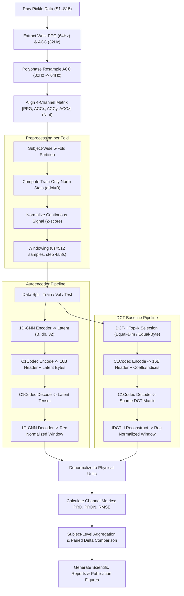

# C1_AE_DCT — Wearable IoT Signal Compression Pipeline
> **Deep 1D-CNN Autoencoder vs. Discrete Cosine Transform (DCT-II) Baseline on PPG-DaLiA Dataset**


---

## OVERVIEW (TỔNG QUAN ĐỀ TÀI)

Dự án nghiên cứu và triển khai hệ thống **nén dữ liệu tín hiệu sinh học nhiều kênh trên thiết bị đeo IoT (Wearable Edge Computing)**. 

Bài toán đặt ra là tối ưu hóa việc truyền tải dữ liệu cảm biến đa kênh liên tục — bao gồm 1 kênh Quang thể tích đồ (**Wrist PPG @ 64Hz**) và 3 kênh Gia tốc kế (**Wrist ACCx, ACCy, ACCz @ 32Hz**) thu thập từ thiết bị đeo Empatica E4 trong các chuỗi hoạt động thể chất phức tạp.

Dự án thực hiện so sánh đối đầu toàn diện giữa:
1. **1D-CNN Autoencoder (AE):** Nén tín hiệu vật lý không gian 4 kênh vào không gian ẩn $M = 32 \times d_b$ ($d_b \in \{16, 8, 4, 2\}$ tương ứng tỷ lệ nén chiều $CR_{\text{dim}} \in \{4\times, 8\times, 16\times, 32\times\}$).
2. **Discrete Cosine Transform (DCT-II) Top-K Baseline:** Thuật toán nén tiêu chuẩn được khớp chính xác cả về **ngân sách chiều ($K=M$)** và **ngân sách byte thực tế ($B_{\text{DCT}} = B_{\text{AE}}$)**.

---

## CURRENT EXPERIMENT STATUS DASHBOARD

> [!IMPORTANT]
> **Phân định Rõ ràng giữa Dữ liệu Thử nghiệm Synthetic và Real Data:**
> Toàn bộ pipeline đã được chuyển hóa 100% sang dữ liệu thực nghiệm **PPG-DaLiA thật**. Các kết quả synthetic/smoke-test cũ đã được đóng gói và cô lập trong thư mục `synthetic_smoke_test/` nhằm đảm bảo tính minh bạch khoa học.

| Hạng mục Kiểm định | Trạng thái | Chi tiết & Kết quả thực nghiệm |
| :--- | :---: | :--- |
| **Unit & Integration Test Suite** | **100% PASS** | **78/78 tests PASSED** (63 unit tests + 15 real integration tests). |
| **PPG-DaLiA Dataset Integration** | **100% VERIFIED** | Đã phát hiện & bóc tách đủ 15 subjects ($S1 \dots S15$, 0 NaN, 0 Inf). |
| **Train-Only Normalization** | **100% VERIFIED** | Thống kê Z-score ($ddof=0$) được tính **chỉ từ tập Train** cho từng fold. |
| **Fold 1 Sanity Check** | **18/18 PASS** | End-to-end Sanity Check trên 3,268 Test windows thật của Fold 1 hoàn thành. |
| **20 Main Runs (5 Folds $\times$ 4 $d_b$)** | **COMPLETED** | **20 real AE checkpoints** ($d_b \in \{16, 8, 4, 2\}$, seed 42) đã được huấn luyện & đánh giá trên 15 subjects thật. |
| **15 Seed Stability Runs ($d_b=8$)** | **COMPLETED** | **15 real checkpoints** (5 seed42 reused from main + 10 additional seed123 & seed999 across 5 folds). |

---

## SYSTEM ARCHITECTURE & DATA FLOW

Dưới đây là sơ đồ luồng dữ liệu end-to-end từ file pickle thô đến các chỉ số đánh giá nén:



---

## QUICK START (HƯỚNG DẪN CHẠY NHANH)

### 1. Thiết lập Môi trường

```bash
# Clone repository
git clone https://github.com/sai-ctruong/iot_C1_AE_DCT.git
cd iot_C1_AE_DCT/C1_AE_DCT

# Tạo và kích hoạt virtual environment
python -m venv .venv
source .venv/bin/activate  # Trên Windows: .\.venv\Scripts\Activate.ps1

# Cài đặt phụ thuộc
pip install --upgrade pip
pip install -r requirements.txt
```

### 2. Thực thi Preprocessing Dữ liệu Thật

Script sẽ tự động đọc 15 subjects, kiểm kê dữ liệu (`results/data_inventory.csv`), thực hiện polyphase resample ACC 32Hz $\to$ 64Hz, tính norm stats tập Train từng fold và cắt cửa sổ $T=512$:

```bash
python -m src.prepare_data
```

### 3. Chạy Real Pilot Run (Fold 1, $d_b=8$, Seed 42)

```bash
python -m src.pilot_run
```

### 4. Chạy End-to-End Sanity Check (Fold 1 Test Set)

```bash
python -m src.sanity_check_fold1
```

### 5. Kiểm thử Suite Tests Tự động

```bash
python -m pytest tests/
```

### 6. Trực quan hóa & Demo bằng Jupyter Notebook

Khởi chạy Notebook minh họa end-to-end pipeline:

```bash
jupyter notebook notebooks/C1_AE_DCT_Demo.ipynb
```

> [!NOTE]
> Jupyter Notebook `notebooks/C1_AE_DCT_Demo.ipynb` được thiết kế chuyên biệt cho việc trực quan hóa, kiểm chứng từng bước và hỗ trợ thuyết trình/báo cáo. Tất cả các thí nghiệm chính thức (20 main runs và 15 seed runs) được vận hành bằng các script tự động trong thư mục `src/*.py`.

---

## EMPIRICAL SANITY CHECK RESULTS (FOLD 1 TEST SET)

Sanity Check đã chạy thành công trên toàn bộ **3,268 cửa sổ Test thật của Fold 1** (Subjects $S1, S2, S3$).

### 1. Kiểm tra Ngân sách Byte & Reference Bitstream Codec

Tất cả các bitstream được đóng gói với **16-byte Header tiêu chuẩn** (`magic`, `codec_id`, `d_b`, `count`, `profile_id`, `payload_bytes`):

| Phương pháp (Method) | $d_b$ | $M$ / $K$ | Padding Bytes | Kích thước Bitstream (Bytes/Window) | Ngân sách Byte so với AE ($B_{\text{AE}}$) | Codec Check |
| :--- | :---: | :---: | :---: | :---: | :---: | :---: |
| **AE Pilot** | 8 | $M=256$ | 0 | **1,040 B** | Baseline | **PASS** |
| **DCT Equal-Dim** | 8 | $K=256$ | 0 | **1,552 B** | $+49.2\%$ | **PASS** |
| **DCT Equal-Byte** | 8 | $K=170$ | 4 | **1,040 B** | $\equiv B_{\text{AE}}$ (**Khớp 100%**) | **PASS** |

### 2. Bảng Thống kê Chỉ số Méo dạng (Mean $\pm$ Std ngang Subjects Tập Test)

| Phương pháp | Kênh Signal | Tỷ lệ nén $CR_{\text{dim}}$ | Tỷ lệ nén $CR_{\text{byte\_64}}$ | PRD (%) Mean$\pm$Std | PRDN (%) Mean$\pm$Std | RMSE Mean$\pm$Std |
| :--- | :---: | :---: | :---: | :---: | :---: | :---: |
| **AE Pilot ($d_b=8$)** | PPG | 8.0x | 7.88x | $17.09 \pm 4.68\%$ | $17.11 \pm 4.68\%$ | $8.3835 \pm 1.4226$ |
| **DCT Equal-Dim ($K=256$)** | PPG | 8.0x | 5.28x | $8.91 \pm 3.36\%$ | $8.92 \pm 3.37\%$ | $4.1416 \pm 0.2211$ |
| **DCT Equal-Byte ($K=170$)** | PPG | 12.05x | 7.88x | $12.76 \pm 4.72\%$ | $12.78 \pm 4.72\%$ | $6.0145 \pm 0.4062$ |
| **AE Pilot ($d_b=8$)** | ACCx | 8.0x | 7.88x | $15.52 \pm 1.38\%$ | $120.02 \pm 18.21\%$ | $0.0712 \pm 0.0020$ |
| **DCT Equal-Dim ($K=256$)** | ACCx | 8.0x | 5.28x | $6.34 \pm 0.73\%$ | $22.95 \pm 0.91\%$ | $0.0296 \pm 0.0013$ |
| **DCT Equal-Byte ($K=170$)** | ACCx | 12.05x | 7.88x | $9.21 \pm 0.93\%$ | $33.20 \pm 1.70\%$ | $0.0431 \pm 0.0021$ |

> [!NOTE]
> Kết quả dạng sóng tái lập thực tế đã được xuất tự động tại file đồ thị:
> [results/sanity_fold1/fold1_reconstruction_examples.png](file:///d:/UTE/AIForIOT/project_Cuoiki_iot/C1_AE_DCT/results/sanity_fold1/fold1_reconstruction_examples.png).

---

## SPECIAL SCIENTIFIC SPECIFICATIONS (QUY TẮC ĐỀ TƯƠNG KHOA HỌC)

Dự án tuân thủ nghiêm ngặt 10 quy tắc khóa đề cương:
1. **Không đổi đề tài:** Giữ nguyên bài toán nén tín hiệu PPG & ACC trên thiết bị đeo IoT.
2. **Không đổi kiến trúc AE:** Conv1d $4\to 16\to 32\to 64$ + Linear $64\to d_b$ + ConvTranspose1d $d_b\to 64\to 32\to 16\to 4$ ($k=5, s=2, p=2$, output_padding=1).
3. **Không thêm các kỹ thuật phụ:** Không BatchNorm, Dropout, Attention, Skip connections.
4. **Khóa 5-Fold Subject-Wise:**
   - Fold 1: Train S6-S15 | Val S4,S5 | Test S1,S2,S3
   - Fold 2: Train S1-S3,S9-S15 | Val S7,S8 | Test S4,S5,S6
   - Fold 3: Train S1-S6,S12-S15 | Val S10,S11 | Test S7,S8,S9
   - Fold 4: Train S1-S9,S15 | Val S13,S14 | Test S10,S11,S12
   - Fold 5: Train S3-S12 | Val S1,S2 | Test S13,S14,S15
5. **Không dùng Test để Tune:** Tập Test $S1 \dots S15$ hoàn toàn cô lập, chỉ dùng đánh giá final.
6. **Xử lý denominator gần 0:** Denominator $\le threshold_c$ (với $threshold_c = N \cdot 10^{-12} \cdot \sigma_c^2$) đánh dấu `valid_prdn = False` và đặt metric `NaN`. Không cộng epsilon tùy tiện vào mẫu số.

---

## DIRECTORY STRUCTURE (CẤU TRÚC THƯ MỤC)

```text
C1_AE_DCT/
├── configs/
│   ├── config.json                     # Cấu hình dự án (batch_size=128, max_epoch=100, lr=1e-3, patience=10)
│   ├── config.yaml                     # Cấu hình dạng YAML (đồng bộ với config.json)
│   ├── folds.json                      # Cấu hình phân chia 5-fold subject split (S1-S15)
│   └── norm_stats_fold1..5.json        # Thống kê Z-score (mean, std) tính CHỈ từ tập Train từng fold
├── data/
│   ├── raw/                            # Thư mục gốc chứa 15 file S1.pkl .. S15.pkl
│   └── processed/                      # Thư mục lưu dữ liệu nén .npz đã resample & windowing theo fold
├── src/
│   ├── __init__.py
│   ├── dataset.py                      # Loader dữ liệu PPG-DaLiA pickle & export data_inventory.csv
│   ├── resample.py                     # Resample ACC 32Hz -> 64Hz bằng Polyphase Filter (resample_poly)
│   ├── windowing.py                    # Cắt cửa sổ 8s (512 mẫu), step 4s (Train/Val) & step 8s (Test)
│   ├── normalize.py                    # Z-score normalization (Train-only statistics, ddof=0)
│   ├── model.py                        # Kiến trúc 1D-CNN Autoencoder (C1Autoencoder)
│   ├── loss.py                         # Hàm tổn thất Reconstruction MSE Loss
│   ├── baseline_dct.py                 # DCT-II Top-K baseline & reconstruction logic
│   ├── codec.py                        # Bitstream Encoder/Decoder với 16-byte Header chuẩn
│   ├── metrics.py                      # Hàm tính CR_dim, CR_byte và khớp ngân sách byte (B_AE = B_DCT)
│   ├── evaluate.py                     # Đánh giá PRD, PRDN, RMSE độc lập 4 kênh & valid-mask
│   ├── results_schema.py               # Schema kết quả 19 trường & helper join AE/DCT
│   ├── prepare_data.py                 # Pipeline tiền xử lý end-to-end dữ liệu thật
│   ├── sanity_check_fold1.py           # Script thực thi end-to-end Sanity Check trên Fold 1 Test
│   ├── pilot_run.py                    # Pilot run huấn luyện trên dữ liệu thật PPG-DaLiA
│   ├── run_main_experiments.py         # Launcher 20 Main Runs (5 Folds x 4 db)
│   ├── run_seed_experiments.py         # Launcher 10 Seed Runs (db=8, seeds 123, 999 across 5 folds + 5 reused seed 42 runs)
│   ├── make_report.py                  # Script tổng hợp báo cáo và vẽ đồ thị khoa học
│   └── utils.py                        # Helper functions & kiểm tra phần cứng
├── tests/                              # Suite chứa 78 Unit & Integration Tests
│   ├── test_real_pipeline.py           # Suite 15 integration test cases kiểm thử pipeline thật
│   └── ...
├── checkpoints/                        # Lưu trữ model weights (.pt) sinh từ dữ liệu thật
│   └── synthetic_smoke_test/           # Cô lập checkpoints synthetic cũ
├── logs/                               # Nhật ký huấn luyện
│   └── synthetic_smoke_test/           # Cô lập logs synthetic cũ
├── results/                            # Thư mục kết quả xuất tự động (CSV, PNG, Markdown)
│   ├── data_inventory.csv              # Báo cáo kiểm kê 15 subjects dữ liệu thật
│   ├── sanity_fold1/                   # Báo cáo & Đồ thị Sanity Check Fold 1 Test
│   └── synthetic_smoke_test/           # Cô lập kết quả synthetic cũ
├── requirements.txt                    # Thư viện phụ thuộc
└── README.md                           # Tài liệu hướng dẫn sử dụng
```

---

## HARDWARE & SOFTWARE SPECIFICATIONS

| Thông số | Chi tiết Môi trường Thực nghiệm |
| :--- | :--- |
| **Hệ điều hành** | Windows 11 Home/Pro 64-bit |
| **Bộ xử lý (CPU)** | AMD Ryzen / Intel Core Series (AMD64 Architecture) |
| **Bộ nhớ RAM** | 16 GB System Memory |
| **GPU / Acceleration** | CPU Execution Mode (PyTorch 2.x) |
| **Python Version** | Python `3.10+` (Tested on Python `3.14.5`) |
| **Core Libraries** | PyTorch `2.x`, NumPy `2.x`, SciPy `1.x`, Matplotlib `3.x`, PyTest `9.x` |

---

## CITATION & REFERENCES

1. **PPG-DaLiA Dataset Reference:**
   > Reiss, A., Indlekofer, I., Schmidt, P., & Van Laerhoven, K. (2019). *Deep PPG: Large-Scale Heart Rate Estimation from Photoplethysmography Using Convolutional Neural Networks*. Sensors, 19(14), 3079.
2. **Signal Distortion Metrics:**
   > Zigel, Y., Cohen, A., & Katz, A. (2000). *The weighted diagnostic distortion (WDD) measure for ECG signal compression evaluation*. IEEE Transactions on Biomedical Engineering, 47(11), 1422-1430.

---
*C1_AE_DCT Repository — Maintained for Edge Signal Processing & IoT Research.*
