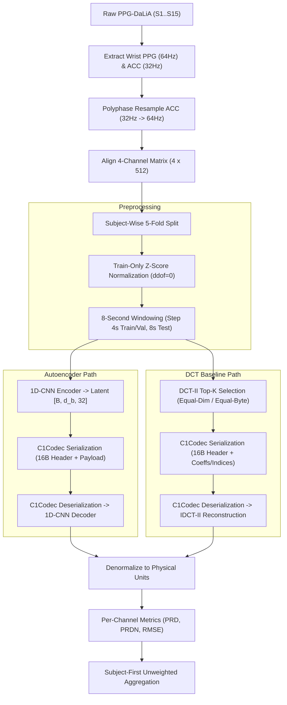
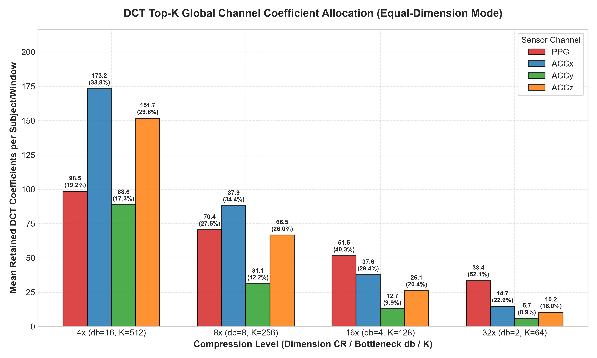
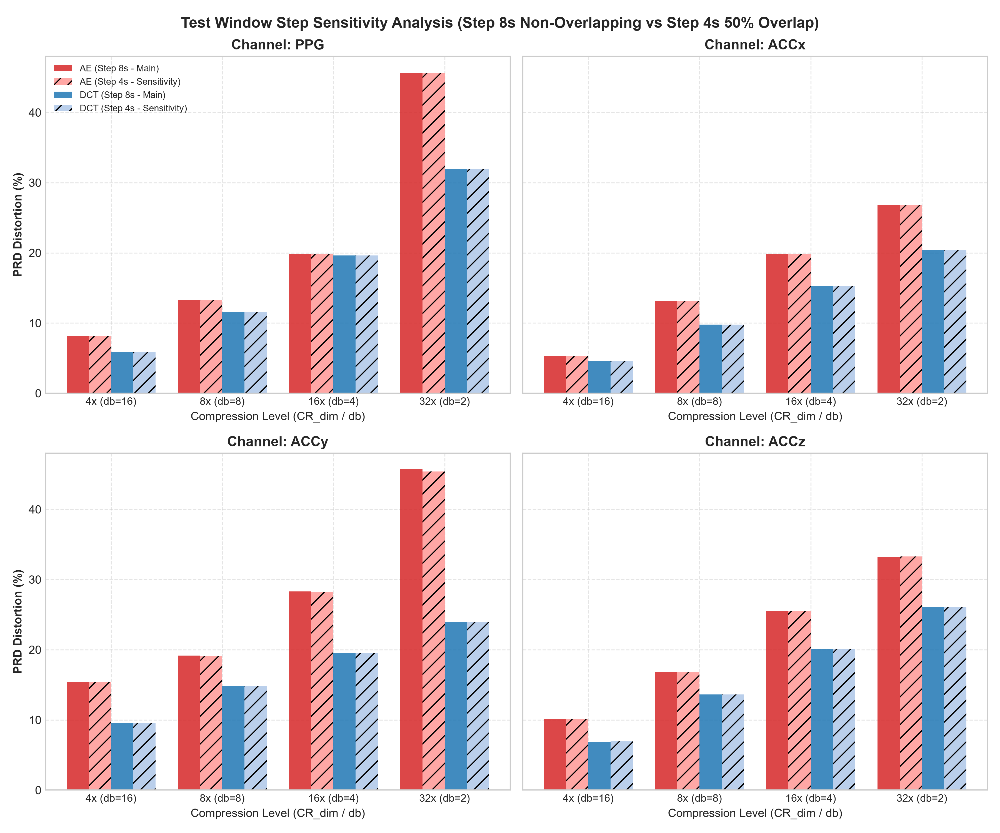
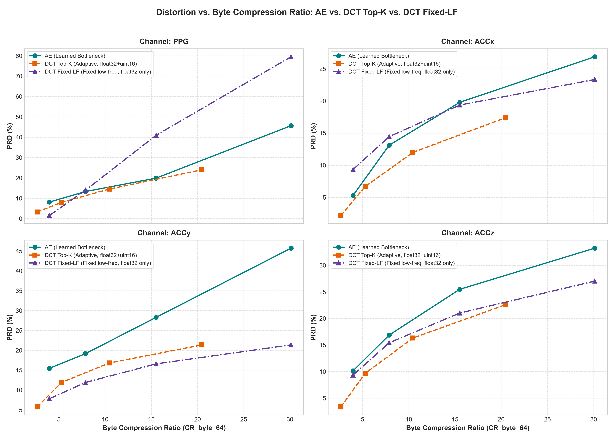

# 🫀 C1_AE_DCT

### 1D-CNN Autoencoder vs. DCT-II for Wearable PPG & ACC Signal Compression

A reproducible experimental pipeline for comparing learned (1D-CNN Autoencoder) and classical transform-based (Discrete Cosine Transform DCT-II) compression of multichannel wearable sensor signals on the benchmark PPG-DaLiA dataset.

<p align="center">
  
  
  
  
  
  
</p>

<p align="center">
  <a href="#overview">Overview</a> •
  <a href="#-project-at-a-glance">Project at a Glance</a> •
  <a href="#-end-to-end-pipeline">Pipeline</a> •
  <a href="#-1d-cnn-autoencoder">Architecture</a> •
  <a href="#-experimental-design">Experiments</a> •
  <a href="#-results-at-a-glance">Results</a> •
  <a href="#-key-figures">Figures</a> •
  <a href="#-jupyter-notebook-demo">Demo</a> •
  <a href="#-quick-start">Quick Start</a> •
  <a href="#-reproducibility">Reproducibility</a>
</p>

---

## Overview

Modern wearable health monitors collect continuous photoplethysmography (PPG) and tri-axial accelerometer (ACC) data to estimate physiological signals during daily living. Transmitting uncompressed high-frequency sensor streams consumes excessive battery and radio bandwidth.

This repository implements a rigorous, reproducible benchmark comparing a deep **1D-CNN Autoencoder (AE)** against a classical **Discrete Cosine Transform (DCT-II) Global Top-K** baseline under two distinct budget constraints:
- **Equal-Dimension Mode ($K = M$):** Matches the exact number of retained numerical elements.
- **Equal-Byte Mode ($K = \lfloor 4M / 6 \rfloor$):** Matches the exact transmitted bitstream byte payload size including a standardized 16-byte binary header (`C1Codec`).

Evaluations are performed across 15 real test subjects ($S1 \dots S15$) using subject-wise 5-fold cross-validation. All distortion metrics (**PRD**, **PRDN**, **RMSE**) are evaluated on denormalized physical signal units using subject-first unweighted aggregation.

---

## 📋 Project at a Glance

| Parameter | Technical Specification |
| :--- | :--- |
| **Benchmark Dataset** | PPG-DaLiA (Real Wearable Sensors, 15 Subjects $S1 \dots S15$) |
| **Input Channels** | 4 Channels: Wrist PPG (1 ch) + Wrist ACCx, ACCy, ACCz (3 ch) |
| **Sampling Rates** | Wrist PPG @ 64 Hz, Wrist ACC @ 32 Hz $\to$ Polyphase resampled to 64 Hz |
| **Input Matrix** | $4 \text{ channels} \times 512 \text{ samples}$ per 8-second window ($N_{\text{raw}} = 2048$ values) |
| **Cross-Validation** | Subject-wise 5-fold CV ($S1..S3 \to \text{F1}$, $S4..S6 \to \text{F2}$, $S7..S9 \to \text{F3}$, $S10..S12 \to \text{F4}$, $S13..S15 \to \text{F5}$) |
| **AE Bottleneck ($d_b$)** | $d_b \in \{16, 8, 4, 2\} \implies \text{Latent dimension } M \in \{512, 256, 128, 64\}$ |
| **Dimension CR ($CR_{\text{dim}}$)** | $4\times, 8\times, 16\times, 32\times$ relative to 2048 raw inputs |
| **Baseline Method** | Discrete Cosine Transform (DCT-II) Global Top-K ($K_{\text{equal\_dim}}$ & $K_{\text{equal\_byte}}$) |
| **Distortion Metrics** | PRD (%), PRDN (%), RMSE in original physical signal units |
| **Experiment Runs** | 20 Main Checkpoints ($5 \text{ folds} \times 4 d_b$) + 15 Seed Stability Runs ($d_b=8$, seeds 42, 123, 999) |
| **Automated Suite** | 96 Unit & Integration Tests PASSED (`python -m pytest tests/`) |
| **Interactive Demo** | Jupyter Notebook available under `notebooks/C1_AE_DCT_Demo.ipynb` |

---

## 🔄 End-to-End Pipeline



---

## 🧠 1D-CNN Autoencoder

The neural compression model employs a lightweight, symmetric 1D convolutional architecture. To maximize determinism and edge hardware compatibility, it intentionally omits auxiliary regularization layers (no BatchNorm, Dropout, Attention, or Skip connections).

```text
Input Window: [Batch, 4 channels, 512 samples]
│
├── Encoder:
│   ├── Conv1d(4 -> 16,  kernel=5, stride=2, padding=2)  -> [B, 16, 256] + ReLU
│   ├── Conv1d(16 -> 32, kernel=5, stride=2, padding=2)  -> [B, 32, 128] + ReLU
│   ├── Conv1d(32 -> 64, kernel=5, stride=2, padding=2)  -> [B, 64, 64]  + ReLU
│   └── Linear(64 -> d_b) per time step                  -> Latent Tensor [B, d_b, 32] (M = 32 * d_b)
│
└── Decoder:
    ├── Linear(d_b -> 64) per time step                  -> Reshaped [B, 64, 64] + ReLU
    ├── ConvTranspose1d(64 -> 32, k=5, s=2, p=2, out_p=1) -> [B, 32, 128] + ReLU
    ├── ConvTranspose1d(32 -> 16, k=5, s=2, p=2, out_p=1) -> [B, 16, 256] + ReLU
    └── ConvTranspose1d(16 -> 4,  k=5, s=2, p=2, out_p=1) -> Reconstructed Output [B, 4, 512]
```

### Architectural Details
- **Activations:** `ReLU` activations on all hidden encoder/decoder layers.
- **Bottleneck Layer:** Linear projection ($\text{Linear}(64 \to d_b)$ per step) producing bottleneck vector $M = 32 \times d_b$.
- **Output Layer:** Linear output producing unconstrained continuous physical waveform estimates.

---

## 🎛️ Compression Setup & Payload Alignment

To enable fair comparisons, transmitted payload sizes are calculated using the exact reference binary format (`C1Codec`), which prepends a standardized 16-byte header (`<4sBBHII`):

| $d_b$ | Latent Elements ($M$) | AE $CR_{\text{dim}}$ | DCT $K$ (Equal-Dim) | DCT $K$ (Equal-Byte) | Transmitted Payload Size ($B_{\text{AE}} = B_{\text{DCT}}$) |
| :---: | :---: | :---: | :---: | :---: | :---: |
| **16** | 512 | $4.0\times$ | 512 | 341 | **2,064 Bytes** |
| **8** | 256 | $8.0\times$ | 256 | 170 | **1,040 Bytes** |
| **4** | 128 | $16.0\times$ | 128 | 85 | **528 Bytes** |
| **2** | 64 | $32.0\times$ | 64 | 42 | **272 Bytes** |

### Reference Representation Sizes
- **Resampled 64 Hz Window Bytes:** $4 \text{ ch} \times 512 \text{ samples} \times 4 \text{ bytes (float32)} = 8,192 \text{ bytes}$ ($CR_{\text{byte\_64}} = 8192 / \text{nbytes}$).
- **Native PPG-DaLiA Window Bytes:** $(512 \text{ PPG} + 256 \times 3 \text{ ACC}) \times 4 = 5,120 \text{ bytes}$ ($CR_{\text{byte\_native}} = 5120 / \text{nbytes}$).
- **AE Bitstream:** $B_{\text{AE}} = 16 + 4M \text{ bytes}$ ($M$ float32 values).
- **DCT Bitstream:** $B_{\text{DCT}} = 16 + 6K + \text{padding} \text{ bytes}$ ($K$ float32 values + $K$ uint16 flat indices).

---

## 🧪 Experimental Design

- **Cross-Validation:** Subject-wise 5-fold CV (10 Train / 2 Val / 3 Test subjects per fold). Every subject appears in the Test set exactly once.
- **Windowing:** 8-second windows ($512$ samples @ 64 Hz).
  - Train / Val step size = 4 seconds (50% overlap).
  - Test step size = 8 seconds (0% overlap, non-overlapping evaluation).
- **Normalization:** Train-only Z-score statistics ($\mu, \sigma$ per channel with $\text{ddof}=0$). Test windows are normalized using training statistics of the corresponding fold.
- **Optimization:** Adam optimizer ($\text{lr}=1\text{e-}3$, batch size = 128, max 100 epochs, early stopping patience = 10 on validation loss).
- **Seed Stability:** Primary seed 42 across all 20 main runs. Additional seeds (123, 999) evaluated at $d_b=8$ across all 5 folds to verify training stability.

<details>
<summary>🔍 Click to expand subject fold assignments</summary>

| Fold | Test Subjects | Validation Subjects | Training Subjects |
| :---: | :--- | :--- | :--- |
| **Fold 1** | $S1, S2, S3$ | $S4, S5$ | $S6, S7, S8, S9, S10, S11, S12, S13, S14, S15$ |
| **Fold 2** | $S4, S5, S6$ | $S7, S8$ | $S1, S2, S3, S9, S10, S11, S12, S13, S14, S15$ |
| **Fold 3** | $S7, S8, S9$ | $S10, S11$ | $S1, S2, S3, S4, S5, S6, S12, S13, S14, S15$ |
| **Fold 4** | $S10, S11, S12$ | $S13, S14$ | $S1, S2, S3, S4, S5, S6, S7, S8, S9, S15$ |
| **Fold 5** | $S13, S14, S15$ | $S1, S2$ | $S3, S4, S5, S6, S7, S8, S9, S10, S11, S12$ |

</details>

---

## 📌 Project Status Dashboard

| Milestone / Subsystem | Status | Verification Detail |
| :--- | :---: | :--- |
| **Dataset Integration** | ✅ Complete | 15/15 subjects ingested without missing frames or NaNs |
| **Polyphase Resampling** | ✅ Complete | Wrist ACC resampled 32 Hz $\to$ 64 Hz using `scipy.signal.resample_poly` |
| **Main AE Model Runs** | ✅ Complete | 20/20 checkpoints saved under `checkpoints/fold0{1..5}_db{02,04,08,16}_seed42.pt` |
| **Seed Stability Evaluation** | ✅ Complete | 15 runs evaluated ($d_b=8$, seeds 42, 123, 999) |
| **Equal-Dimension Baseline** | ✅ Complete | Evaluated at $K \in \{512, 256, 128, 64\}$ across 15 subjects |
| **Equal-Byte Baseline** | ✅ Complete | Evaluated at $K \in \{341, 170, 85, 42\}$ across 15 subjects |
| **DCT Channel Allocation** | ✅ Complete | Per-channel Top-K distribution analyzed and plotted |
| **Test Step Sensitivity** | ✅ Complete | 50% overlap (step=4s) sensitivity analysis completed |
| **DCT Fixed Low-Frequency** | ✅ Complete | Index-free `DCT-Fixed-LF` bonus extension evaluated |
| **Automated Test Suite** | ✅ Complete | **96/96 Unit & Integration Tests PASSED** |
| **Interactive Demo** | ✅ Complete | Jupyter Notebook ready under `notebooks/C1_AE_DCT_Demo.ipynb` |

---

## 📊 Results at a Glance

All distortion metrics are evaluated on denormalized physical signal units, computed per window and channel, aggregated per subject, and averaged across all 15 test subjects (subject-first unweighted aggregation).

### Representative Results ($d_b=8$, $CR_{\text{dim}}=8\times$, Wrist PPG Channel)

| Method | Comparison Mode | Target $K$ or $d_b$ | Transmitted Size | PRD (%) Mean$\pm$Std | PRDN (%) Mean$\pm$Std | RMSE Mean$\pm$Std |
| :--- | :---: | :---: | :---: | :---: | :---: | :---: |
| **1D-CNN Autoencoder** | `ae` | $d_b = 8$ ($M=256$) | 1,040 Bytes | $13.29 \pm 3.61\%$ | $13.31 \pm 3.61\%$ | $8.29 \pm 2.58$ |
| **DCT-II Baseline** | `equal_dim` | $K = 256$ | 1,552 Bytes | $7.97 \pm 2.37\%$ | $7.98 \pm 2.38\%$ | $4.69 \pm 1.48$ |
| **DCT-II Baseline** | `equal_byte` | $K = 170$ | 1,040 Bytes | $11.57 \pm 3.20\%$ | $11.58 \pm 3.21\%$ | $6.90 \pm 2.13$ |

*Summary Finding: Under the current 1D-CNN architecture and unweighted MSE training objective, the classical DCT-II Top-K baseline achieves lower reconstruction distortion than the AE configuration across tested compression settings. On optical PPG signals, DCT coefficient energy is highly concentrated in low-frequency cardiac harmonics.*

---

## 📈 Key Figures

### 1. Distortion vs. Dimension Compression Ratio ($CR_{\text{dim}}$)
PRD distortion (%) across dimension compression levels $4\times, 8\times, 16\times, 32\times$:


### 2. Distortion vs. Byte Compression Ratio ($CR_{\text{byte\_64}}$)
PRD distortion (%) plotted against byte-matched compression ratio:


### 3. Waveform Reconstruction Examples
Visual comparison of original vs. reconstructed signals for PPG and ACC channels:


### 4. DCT Top-K Global Channel Allocation
Dynamic distribution of retained DCT coefficients across PPG and ACC channels:



<details>
<summary>🔍 Click to view additional diagnostic figures</summary>

#### Failure Case Analysis (Highest Distortion Windows)


#### Test Window Step Sensitivity (Step 8s vs Step 4s)


#### DCT Fixed Low-Frequency Baseline Comparison


</details>

---

## ✨ Optional Extensions

This repository includes three optional post-core research extensions that explore specific signal processing trade-offs. *Note: Optional extensions do not alter or replace mandatory core experimental results.*

1. **DCT Top-K Channel Allocation Analysis:**
   - Evaluates how Global Top-K dynamically partitions its coefficient budget across sensor channels.
   - *Artifacts:* `results/dct_channel_allocation_summary.csv`, `results/dct_channel_allocation_analysis.md`
2. **Test Window Step Sensitivity Analysis (50% Overlap):**
   - Compares official non-overlapping test evaluation (step = 8s) against 50% overlapping windows (step = 4s, 32,122 test windows).
   - *Artifacts:* `results/sensitivity_step4/step4_vs_step8.csv`, `results/sensitivity_step4/analysis.md`
3. **Fixed Low-Frequency DCT Baseline (`DCT-Fixed-LF`):**
   - Eliminates coefficient index transmission ($uint16$) by retaining a deterministic low-frequency coefficient set per channel ($B_{\text{DCT\_FIXED}} = 16 + 4K \text{ bytes}$).
   - *Artifacts:* `results/extensions/dct_fixed_lf_summary.csv`, `results/extensions/dct_fixed_lf_analysis.md`

---

## 📘 Jupyter Notebook Demo

An interactive demonstration notebook is provided to walk through data loading, model inference, DCT baseline encoding, metric computation, and visualization:

```bash
jupyter notebook notebooks/C1_AE_DCT_Demo.ipynb
```

---

## 🚀 Quick Start

### 1. Environment Setup

```bash
# Clone repository
git clone https://github.com/sai-ctruong/iot_C1_AE_DCT.git
cd iot_C1_AE_DCT/C1_AE_DCT

# Create and activate virtual environment
# Linux/macOS:
python3 -m venv .venv
source .venv/bin/activate

# Windows (PowerShell):
python -m venv .venv
.\.venv\Scripts\Activate.ps1

# Upgrade pip and install dependencies
pip install --upgrade pip
pip install -r requirements.txt
```

### 2. Data Preprocessing

Read raw PPG-DaLiA pickle files (`S1.pkl` $\dots$ `S15.pkl`), resample ACC to 64 Hz, compute fold-wise training statistics, and build 8-second window arrays:

```bash
python -m src.prepare_data
```

### 3. Run Verification Tests

Run the full automated pytest suite (96 tests):

```bash
python -m pytest tests/
```

### 4. Execute Pipeline Steps

```bash
# Run quick end-to-end pilot check
python -m src.pilot_run

# Train/evaluate main 20 AE checkpoints
python -m src.run_main_experiments

# Evaluate seed stability (d_b=8, seeds 42, 123, 999)
python -m src.run_seed_experiments

# Run full test set evaluation across all folds
python -m src.evaluate_all

# Generate figures and markdown reports
python -m src.make_report

# Run optional extension: DCT Fixed-LF evaluation
python -m src.run_dct_fixed_lf
```

---

## 📦 Dataset Placement

The **PPG-DaLiA** dataset is not redistributed in this repository. Download the dataset from the official repository and place raw `.pkl` files in the expected path:

```text
C1_AE_DCT/
└── data/
    └── raw/
        ├── S1.pkl
        ├── S2.pkl
        ├── ...
        └── S15.pkl
```

---

## 📁 Repository Structure

```text
C1_AE_DCT/
├── configs/                # Pre-computed fold splits and train normalization stats (JSON)
├── data/                   # Dataset directory (raw PPG-DaLiA pickles & processed NPZ windows)
├── src/                    # Primary Python source code library
│   ├── dataset.py          # PPG-DaLiA data loader and channel extraction
│   ├── resample.py         # Polyphase signal resampler (ACC 32Hz -> 64Hz)
│   ├── windowing.py        # 8-second signal windowing logic
│   ├── normalize.py        # Train-only Z-score normalization (ddof=0)
│   ├── model.py            # 1D-CNN Autoencoder PyTorch architecture
│   ├── loss.py             # MSE reconstruction loss
│   ├── baseline_dct.py     # DCT-II Top-K and Fixed-LF baseline algorithms
│   ├── codec.py            # C1Codec binary bitstream serialization (16B header)
│   ├── metrics.py          # Budget formulas and payload dimension calculators
│   ├── evaluate.py         # Channel PRD, PRDN, and RMSE evaluation engine
│   ├── results_schema.py   # Detailed CSV schema validator
│   ├── prepare_data.py     # Preprocessing pipeline entry point
│   ├── run_main_experiments.py # Main 20 AE checkpoints training/eval runner
│   ├── run_seed_experiments.py # Seed stability evaluation runner
│   ├── run_dct_fixed_lf.py     # Fixed low-frequency DCT extension runner
│   └── make_report.py      # Summary table aggregator and figure generator
├── tests/                  # Automated Pytest suite (96 tests)
├── notebooks/              # Interactive Jupyter demonstration notebook
├── checkpoints/            # Saved PyTorch model checkpoints (.pt)
├── results/                # Evaluation output CSVs, markdown reports, and PNG plots
├── requirements.txt        # Python dependency manifest
└── README.md               # Main project documentation
```

---

## 📄 Key Result Artifacts

| Output File | Description |
| :--- | :--- |
| `results/results.csv.gz` | Detailed window-level evaluation records (1,035,584 rows) |
| `results/summary_table.csv` | Primary Subject-First aggregated summary table |
| `results/overall_summary_equal_dim.csv` | Subject-aggregated equal-dimension metrics |
| `results/overall_summary_equal_byte.csv` | Subject-aggregated equal-byte metrics |
| `results/paired_comparison_equal_dim.csv` | Window-matched AE vs. DCT Top-K equal-dim deltas |
| `results/paired_comparison_equal_byte.csv` | Window-matched AE vs. DCT Top-K equal-byte deltas |
| `results/seed_stability_summary.csv` | Multi-seed stability metrics ($d_b=8$, seeds 42, 123, 999) |
| `results/experiment_summary.md` | Automated Markdown summary report |
| `results/final_validation_report.md` | Final pipeline audit report |
| `results/extensions/dct_fixed_lf_summary.csv` | DCT Fixed-LF extension summary results |

---

## 🔁 Reproducibility

1. **Fixed Folds & Seeds:** Fixed subject-wise 5-fold partitions and explicit random seeds (`seed=42` primary).
2. **Train-Only Normalization:** Z-score normalization parameters ($\mu, \sigma$) are computed exclusively on training fold windows.
3. **Exact Payload Matching:** Both AE and DCT bitstreams use the exact `C1Codec` binary format with 16-byte headers.
4. **Denormalized Physical Metrics:** All distortion metrics are evaluated after inverse normalization to physical units.
5. **No Test-Set Tuning:** Hyperparameters and model checkpoints are locked prior to final test set evaluation.

---

## ⚠️ Scope & Limitations

- **Compression Focus:** This project focuses strictly on signal reconstruction quality (PRD/PRDN/RMSE) under constrained payload budgets.
- **Task Scope:** Does not perform downstream heartbeat detection, activity classification, or clinical diagnosis.
- **Hardware Latency:** Embedded MCU execution latency and power consumption are analyzed theoretically via payload byte length rather than measured on physical microcontrollers.

---

## 📚 References

1. **PPG-DaLiA Dataset:** Reiss et al., *"Deep PPG: Large-Scale Heart Rate Estimation from Photoplethysmography Induced by Motion Artifacts,"* IEEE BSN, 2019.
2. **Discrete Cosine Transform (DCT-II):** Ahmed et al., *"Discrete Cosine Transform,"* IEEE Transactions on Computers, 1974.
3. **PyTorch Signal Processing:** Paszke et al., *"PyTorch: An Imperative Style, High-Performance Deep Learning Library,"* Advances in NIPS, 2019.

---

<p align="center">
  <b>C1_AE_DCT — AI for IoT Final Project</b><br>
  Course: Trí tuệ nhân tạo cho IoT | Student: Phạm Công Trường
</p>
