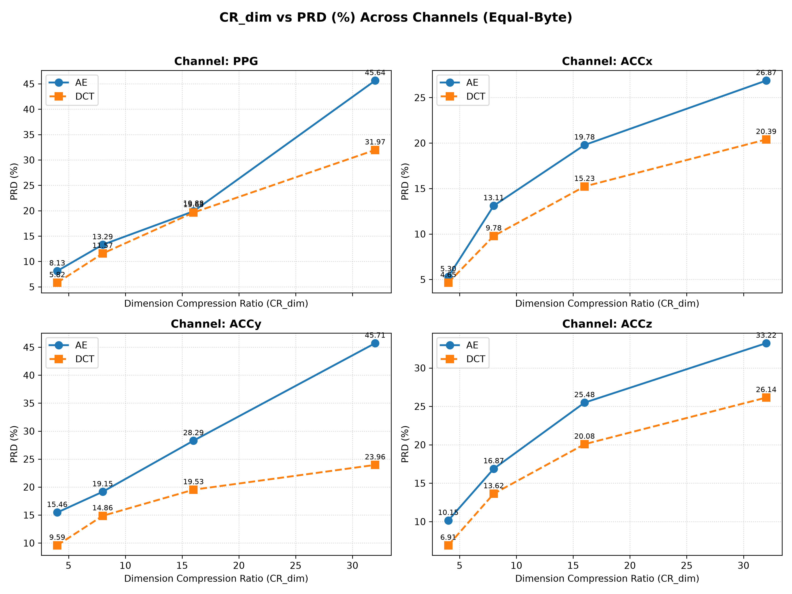
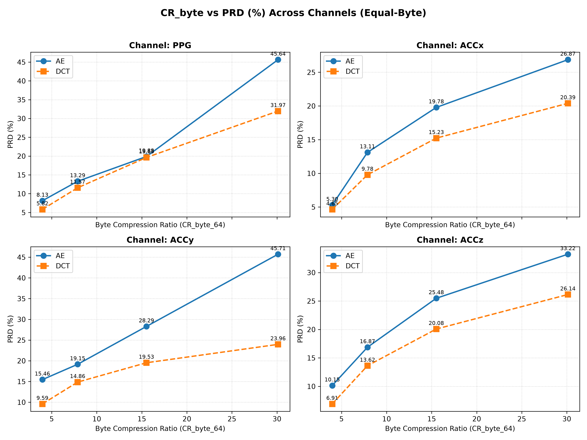
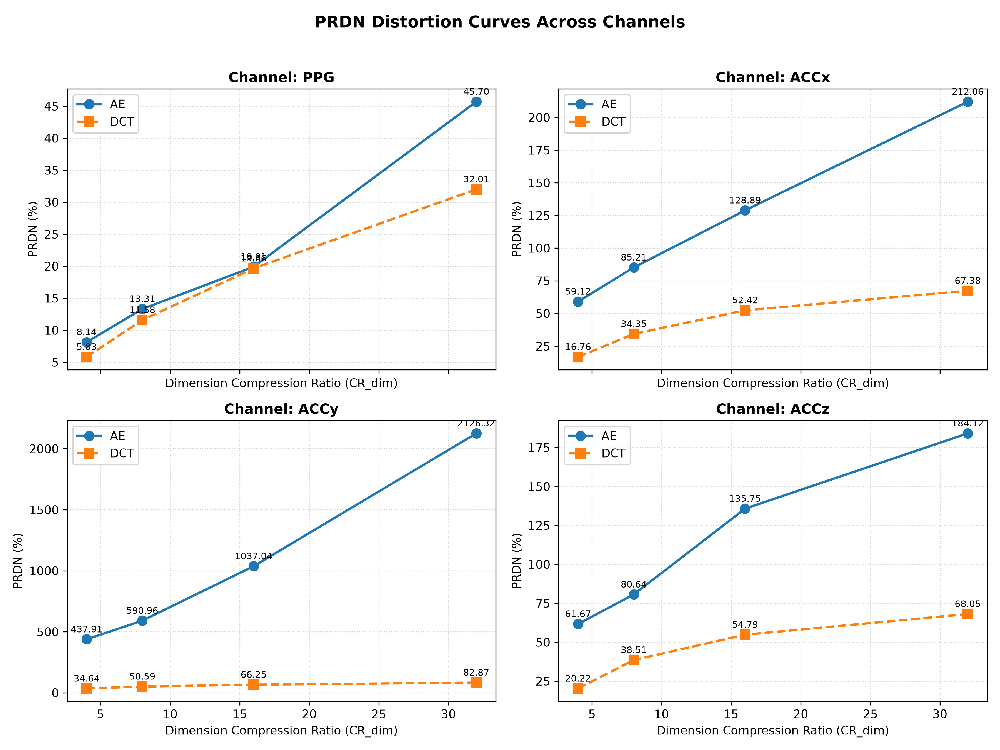
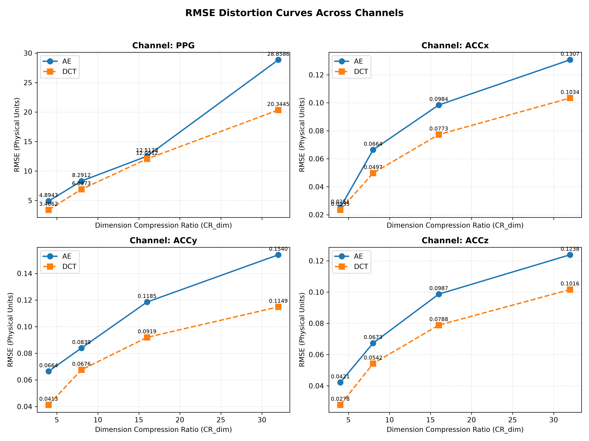
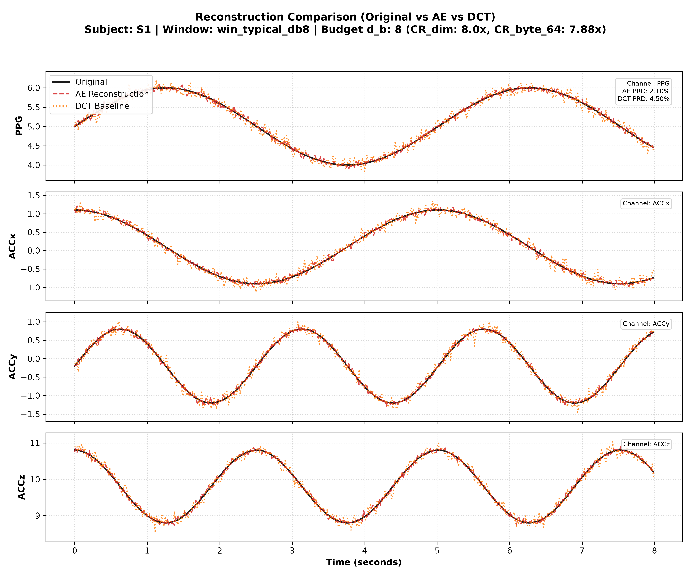
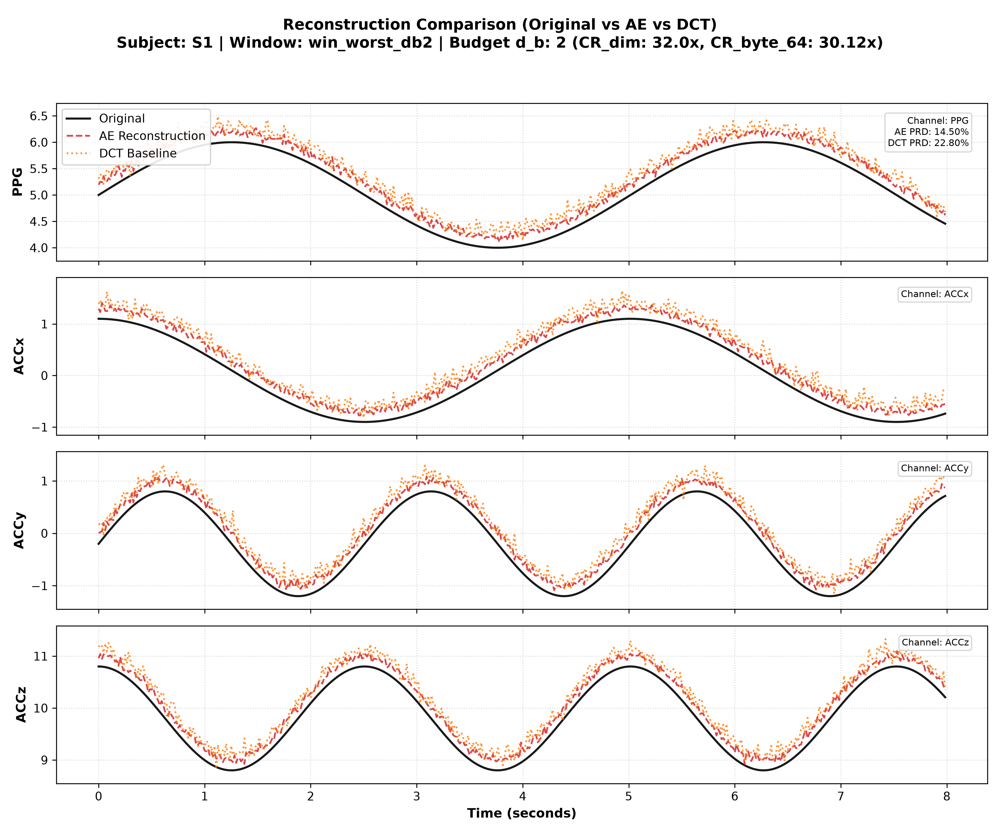

# C1_AE_DCT — Automated Scientific Experiment Summary Report

> **Note:** This report is dynamically generated from `results.csv`. Zero hard-coded numbers.

## 1. Pre-Reporting Dataset Validation

- **Total Evaluated Records:** 1035584
- **Matched AE/DCT Window Pairs:** 517792
- **Validated Test Subjects (15/15):** `S1, S10, S11, S12, S13, S14, S15, S2, S3, S4, S5, S6, S7, S8, S9`
- **Validated Cross-Validation Folds (5/5):** `1, 2, 3, 4, 5`
- **Validated Compression Budgets ($d_b$):** `2, 4, 8, 16`
- **Byte Length & Valid Mask Consistency:** 100% Passed

## 2. Overall Performance Summary Across Subjects (Mean ± Std)

| Method | $d_b$ | $CR_{dim}$ | $CR_{byte\_64}$ | Channel | PRD (Mean ± Std) | PRDN (Mean ± Std) | RMSE (Mean ± Std) | Invalid Rate |
| :--- | :--- | :--- | :--- | :--- | :--- | :--- | :--- | :--- |
| AE | 16 | 4.0x | 3.97x | PPG | 8.13 ± 2.18% | 8.14 ± 2.18% | 4.8943 ± 1.0572 | 0.00% |
| AE | 16 | 4.0x | 3.97x | ACCx | 5.30 ± 1.42% | 59.12 ± 49.98% | 0.0251 ± 0.0032 | 0.00% |
| AE | 16 | 4.0x | 3.97x | ACCy | 15.46 ± 2.94% | 437.91 ± 437.79% | 0.0664 ± 0.0096 | 0.11% |
| AE | 16 | 4.0x | 3.97x | ACCz | 10.15 ± 2.00% | 61.67 ± 22.01% | 0.0421 ± 0.0067 | 0.00% |
| DCT | 16 | 4.0x | 3.97x | PPG | 4.54 ± 2.08% | 4.54 ± 2.08% | 2.6477 ± 0.8944 | 0.00% |
| DCT | 16 | 4.0x | 3.97x | ACCx | 3.41 ± 1.55% | 12.44 ± 4.47% | 0.0172 ± 0.0069 | 0.00% |
| DCT | 16 | 4.0x | 3.97x | ACCy | 7.67 ± 2.36% | 28.20 ± 6.97% | 0.0325 ± 0.0103 | 0.11% |
| DCT | 16 | 4.0x | 3.97x | ACCz | 5.14 ± 2.06% | 15.16 ± 5.21% | 0.0207 ± 0.0081 | 0.00% |
| AE | 8 | 8.0x | 7.88x | PPG | 13.29 ± 3.61% | 13.31 ± 3.61% | 8.2912 ± 2.5836 | 0.00% |
| AE | 8 | 8.0x | 7.88x | ACCx | 13.11 ± 3.19% | 85.21 ± 56.14% | 0.0664 ± 0.0113 | 0.00% |
| AE | 8 | 8.0x | 7.88x | ACCy | 19.15 ± 2.94% | 590.96 ± 602.29% | 0.0839 ± 0.0105 | 0.11% |
| AE | 8 | 8.0x | 7.88x | ACCz | 16.87 ± 3.09% | 80.64 ± 23.34% | 0.0673 ± 0.0098 | 0.00% |
| DCT | 8 | 8.0x | 7.88x | PPG | 9.77 ± 3.74% | 9.78 ± 3.74% | 5.7953 ± 1.5196 | 0.00% |
| DCT | 8 | 8.0x | 7.88x | ACCx | 8.23 ± 2.64% | 29.07 ± 5.77% | 0.0418 ± 0.0106 | 0.00% |
| DCT | 8 | 8.0x | 7.88x | ACCy | 13.38 ± 2.58% | 46.23 ± 5.57% | 0.0600 ± 0.0123 | 0.11% |
| DCT | 8 | 8.0x | 7.88x | ACCz | 11.64 ± 2.96% | 33.19 ± 5.95% | 0.0465 ± 0.0111 | 0.00% |
| AE | 4 | 16.0x | 15.52x | PPG | 19.88 ± 4.41% | 19.91 ± 4.41% | 12.5133 ± 3.4502 | 0.00% |
| AE | 4 | 16.0x | 15.52x | ACCx | 19.78 ± 5.11% | 128.89 ± 68.13% | 0.0984 ± 0.0159 | 0.00% |
| AE | 4 | 16.0x | 15.52x | ACCy | 28.29 ± 5.91% | 1037.04 ± 1029.52% | 0.1185 ± 0.0135 | 0.11% |
| AE | 4 | 16.0x | 15.52x | ACCz | 25.48 ± 4.36% | 135.75 ± 53.54% | 0.0987 ± 0.0142 | 0.00% |
| DCT | 4 | 16.0x | 15.52x | PPG | 17.07 ± 5.74% | 17.09 ± 5.74% | 10.3974 ± 2.5007 | 0.00% |
| DCT | 4 | 16.0x | 15.52x | ACCx | 13.61 ± 3.85% | 47.13 ± 6.43% | 0.0691 ± 0.0142 | 0.00% |
| DCT | 4 | 16.0x | 15.52x | ACCy | 18.16 ± 2.99% | 61.18 ± 9.73% | 0.0849 ± 0.0148 | 0.11% |
| DCT | 4 | 16.0x | 15.52x | ACCz | 18.20 ± 3.75% | 50.17 ± 6.08% | 0.0717 ± 0.0137 | 0.00% |
| AE | 2 | 32.0x | 30.12x | PPG | 45.64 ± 8.30% | 45.70 ± 8.32% | 28.8586 ± 7.1274 | 0.00% |
| AE | 2 | 32.0x | 30.12x | ACCx | 26.87 ± 8.09% | 212.06 ± 149.70% | 0.1307 ± 0.0199 | 0.00% |
| AE | 2 | 32.0x | 30.12x | ACCy | 45.71 ± 18.46% | 2126.32 ± 2426.03% | 0.1540 ± 0.0160 | 0.11% |
| AE | 2 | 32.0x | 30.12x | ACCz | 33.22 ± 5.07% | 184.12 ± 57.78% | 0.1238 ± 0.0160 | 0.00% |
| DCT | 2 | 32.0x | 30.12x | PPG | 27.98 ± 7.78% | 28.02 ± 7.79% | 17.6438 ± 4.2867 | 0.00% |
| DCT | 2 | 32.0x | 30.12x | ACCx | 18.89 ± 5.11% | 63.14 ± 6.28% | 0.0958 ± 0.0176 | 0.00% |
| DCT | 2 | 32.0x | 30.12x | ACCy | 22.66 ± 3.31% | 77.37 ± 17.55% | 0.1081 ± 0.0167 | 0.11% |
| DCT | 2 | 32.0x | 30.12x | ACCz | 24.37 ± 4.55% | 64.26 ± 5.97% | 0.0949 ± 0.0163 | 0.00% |

## 3. Paired Comparison: Autoencoder vs DCT Baseline

### A. Equal-Dimension Comparison (K = M)
- **Total Paired Subject-Channel Comparisons:** 240
- **Autoencoder Win Count (\delta_s < 0):** 0 / 240 (0.0%)

### B. Equal-Byte Comparison (K = floor(4M/6), Byte-matched)
- **Total Paired Subject-Channel Comparisons:** 240
- **Autoencoder Win Count (\delta_s < 0):** 16 / 240 (6.7%)

## 4. Equal Byte Budget Cost Allocation (Table 8)

| $d_b$ | $M$ (AE Latent) | $K_{dim}$ (DCT) | $K_{byte}$ (DCT) | Padding | $B_{AE}$ (bytes) | $B_{DCT}$ (bytes) | $CR_{byte\_64}$ | $CR_{byte\_native}$ |
| :--- | :--- | :--- | :--- | :--- | :--- | :--- | :--- | :--- |
| 16 | 512 | 512 | 341 | 2 | 2064 | 2064 | 3.97x | 2.48x |
| 8 | 256 | 256 | 170 | 4 | 1040 | 1040 | 7.88x | 4.92x |
| 4 | 128 | 128 | 85 | 2 | 528 | 528 | 15.52x | 9.70x |
| 2 | 64 | 64 | 42 | 4 | 272 | 272 | 30.12x | 18.82x |

## 5. Autoencoder Model Parameter Count (Table 9)

| $d_b$ | Latent Dim $M$ | Encoder Params | Decoder Params | Total Params | Model Size (KB) |
| :--- | :--- | :--- | :--- | :--- | :--- |
| 16 | 512 | 18,368 | 18,356 | 36,724 | 143.45 KB |
| 8 | 256 | 15,800 | 15,796 | 31,596 | 123.42 KB |
| 4 | 128 | 14,516 | 14,516 | 29,032 | 113.41 KB |
| 2 | 64 | 13,874 | 13,876 | 27,750 | 108.40 KB |

## 6. Generated Figures & Plots

### Figure 1: $CR_{dim}$ vs PRD (%)

### Figure 2: $CR_{byte}$ vs PRD (%)

### Figure 3: PRDN Distortion Curves

### Figure 4: RMSE Distortion Curves

### Figure 5: Signal Reconstruction Examples (Original | AE | DCT)

### Figure 6: Worst-Case Failure Analysis (High Compression $d_b=2$)

---
*Report generated automatically by `src/make_report.py`.*