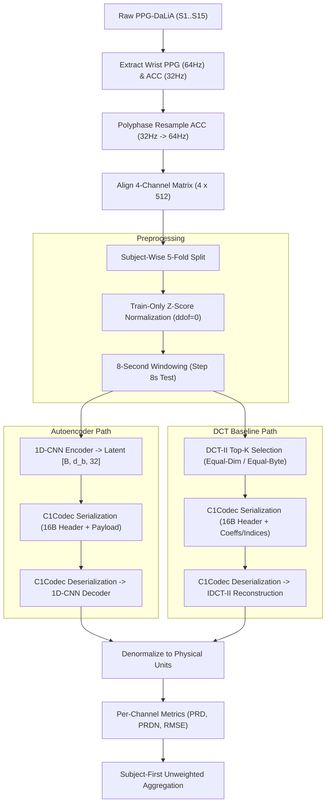

# 🫀 iot_C1_AE_DCT

### 1D-CNN Autoencoder vs. DCT-II for Wearable PPG & ACC Signal Compression

A fully self-contained, reproducible Jupyter Notebook benchmark comparing a learned **1D-CNN Autoencoder** against classical **Discrete Cosine Transform (DCT-II)** Top-K compression on the benchmark PPG-DaLiA dataset.

<p align="center">
  
  
  
  
  
  
</p>

<p align="center">
  <a href="#-main-code-deliverable">Main Code</a> •
  <a href="#overview">Overview</a> •
  <a href="#-project-at-a-glance">Project at a Glance</a> •
  <a href="#-end-to-end-pipeline">Pipeline</a> •
  <a href="#-quick-start">Quick Start</a> •
  <a href="#-repository-structure">Repository Structure</a> •
  <a href="#-reproducibility">Reproducibility</a>
</p>

---

## 🚀 Main Code Deliverable

The **PRIMARY CODE DELIVERABLE** for this final submission is the self-contained Jupyter Notebook:

📌 **[`notebooks/C1_AE_DCT_Demo.ipynb`](notebooks/C1_AE_DCT_Demo.ipynb)**

- **100% Self-Contained:** Contains all Python functions for raw dataset loading, polyphase resampling, subject-wise fold splitting, train-only Z-score normalization, PyTorch 1D-CNN Autoencoder model architecture, DCT-II Global Top-K transform, binary bitstream codec (`C1Codec`), evaluation metrics (PRD/PRDN/RMSE), single-window demonstration, summary table loaders, and visualization plots.
- **Zero External Source Dependency:** Does **NOT** rely on any separate `src/*.py` modules.
- **Top-to-Bottom Executable:** Tested and verified to run top-to-bottom sequentially without errors, warnings, or synthetic fallbacks.

---

## Overview

Modern wearable health monitors collect continuous photoplethysmography (PPG) and tri-axial accelerometer (ACC) data to estimate physiological signals during daily living.

The project evaluates compression ratio and reconstruction distortion on PPG-DaLiA.

This project implements a rigorous, reproducible benchmark comparing a deep **1D-CNN Autoencoder (AE)** against a classical **Discrete Cosine Transform (DCT-II) Global Top-K** baseline under two distinct budget constraints:
- **Equal-Dimension Mode ($K = M$):** Matches the exact number of retained numerical elements.
- **Equal-Byte Mode ($K = \lfloor 4M / 6 \rfloor$):** Matches the exact transmitted bitstream byte payload size including a standardized 16-byte binary header (`C1Codec`).

Evaluations are performed across 15 real test subjects ($S1 \dots S15$) using subject-wise 5-fold cross-validation. All distortion metrics (**PRD**, **PRDN**, **RMSE**) are evaluated on denormalized physical signal units using subject-first unweighted aggregation.

---

## 📋 Project at a Glance

| Parameter | Technical Specification |
| :--- | :--- |
| **Primary Code Deliverable** | [`notebooks/C1_AE_DCT_Demo.ipynb`](notebooks/C1_AE_DCT_Demo.ipynb) (Fully Executable Technical Report) |
| **Benchmark Dataset** | PPG-DaLiA (Real Wearable Sensors, 15 Subjects $S1 \dots S15$) |
| **Input Channels** | 4 Channels: Wrist PPG (1 ch) + Wrist ACCx, ACCy, ACCz (3 ch) |
| **Sampling Rates** | Wrist PPG @ 64 Hz, Wrist ACC @ 32 Hz $\to$ Polyphase resampled to 64 Hz |
| **Input Matrix** | $4 \text{ channels} \times 512 \text{ samples}$ per 8-second window ($N_{\text{raw}} = 2048$ values) |
| **Cross-Validation** | Subject-wise 5-fold CV ($S1..S3 \to \text{F1}$, $S4..S6 \to \text{F2}$, $S7..S9 \to \text{F3}$, $S10..S12 \to \text{F4}$, $S13..S15 \to \text{F5}$) |
| **AE Bottleneck ($d_b$)** | $d_b \in \{16, 8, 4, 2\} \implies \text{Latent dimension } M \in \{512, 256, 128, 64\}$ |
| **Dimension CR ($CR_{\text{dim}}$)** | $4\times, 8\times, 16\times, 32\times$ relative to 2048 raw inputs |
| **Baseline Method** | Discrete Cosine Transform (DCT-II) Global Top-K ($K_{\text{equal\_dim}}$ & $K_{\text{equal\_byte}}$) |
| **Distortion Metrics** | PRD (%), PRDN (%), RMSE in original physical signal units |
| **Canonical Checkpoint** | `models/fold01_db08_seed42.pt` (Fold 1, $d_b=8$, Seed 42) |

---

## 🔄 End-to-End Pipeline



---

## 🧠 1D-CNN Autoencoder Architecture

The neural compression model employs a lightweight, symmetric 1D convolutional architecture:

- **Input:** $[B, 4, 512]$
- **Encoder:** Conv1d(4 $\to$ 16) $\to$ ReLU $\to$ Conv1d(16 $\to$ 32) $\to$ ReLU $\to$ Conv1d(32 $\to$ 64) $\to$ ReLU $\to$ Conv1d(64 $\to$ $d_b$) $\to$ Linear Bottleneck
- **Latent Tensor:** $[B, d_b, 32]$ where $M = d_b \times 32$
- **Decoder:** ConvTranspose1d($d_b \to$ 64) $\to$ ReLU $\to$ ConvTranspose1d(64 $\to$ 32) $\to$ ReLU $\to$ ConvTranspose1d(32 $\to$ 16) $\to$ ReLU $\to$ ConvTranspose1d(16 $\to$ 4) $\to$ Linear Output
- **Conv Kernel Config:** `kernel_size=5, stride=2, padding=2, dilation=1` (Decoder `output_padding=1`)
- **Strict Regularization Rules:** NO BatchNorm, NO Dropout, NO Attention, NO Skip connections.

---

## ⚡ Quick Start

### 1. Environment Setup

Clone the repository and install the dependencies:

```bash
git clone https://github.com/sai-ctruong/iot_C1_AE_DCT.git
cd iot_C1_AE_DCT
pip install -r requirements.txt
```

### 2. Dataset Placement

Download the **PPG-DaLiA** dataset from the official source and place the raw subject pickle files under `data/raw/`:

```text
iot_C1_AE_DCT/
└── data/
    └── raw/
        ├── S1.pkl
        ├── S2.pkl
        ├── ...
        └── S15.pkl
```

*Note: If `data/raw/` is absent, the notebook will automatically load the provided real PPG-DaLiA window artifact at `data/demo/fold1_s1_window.npz`.*

### 3. Launch Notebook

Launch Jupyter Notebook and open the primary deliverable:

```bash
jupyter notebook notebooks/C1_AE_DCT_Demo.ipynb
```

Run all cells from top to bottom (`Kernel` $\to$ `Restart & Run All`).

---

## 📁 Repository Structure

```text
iot_C1_AE_DCT/
├── README.md                          # Main project documentation
├── requirements.txt                  # Python dependency manifest
├── .gitignore                        # Git ignore patterns
│
├── notebooks/
│   └── C1_AE_DCT_Demo.ipynb          # PRIMARY DELIVERABLE: Self-contained notebook
│
├── configs/                          # Cross-validation & normalization configs
│   ├── folds.json                    # Subject-wise 5-fold cross-validation table
│   ├── norm_stats_fold1.json         # Fold 1 Train-only Z-score statistics
│   ├── norm_stats_fold2.json         # Fold 2 Train-only Z-score statistics
│   ├── norm_stats_fold3.json         # Fold 3 Train-only Z-score statistics
│   ├── norm_stats_fold4.json         # Fold 4 Train-only Z-score statistics
│   └── norm_stats_fold5.json         # Fold 5 Train-only Z-score statistics
│
├── data/
│   ├── demo/
│   │   └── fold1_s1_window.npz       # Real PPG-DaLiA demonstration window
│   └── raw/
│       └── .gitkeep                  # Directory placeholder for S1.pkl..S15.pkl
│
├── models/
│   └── fold01_db08_seed42.pt         # Canonical 1D-CNN AE checkpoint (Fold 1, d_b=8, Seed 42)
│
└── results/                          # Final scientific result tables & figures
    ├── overall_summary_equal_dim.csv  # Subject-aggregated equal-dimension summary
    ├── overall_summary_equal_byte.csv # Subject-aggregated equal-byte summary
    ├── paired_comparison_equal_dim.csv# Window-matched AE vs DCT Top-K deltas (Equal-Dim)
    ├── paired_comparison_equal_byte.csv# Window-matched AE vs DCT Top-K deltas (Equal-Byte)
    ├── seed_stability_summary.csv    # Seed stability metrics (seeds 42, 123, 999)
    ├── seed_summary_by_subject.csv   # Multi-seed metrics per subject
    ├── experiment_manifest.csv       # Experiment configuration tracking
    ├── seed_manifest.csv             # Seed experiment tracking
    ├── final_validation_report.md    # Pipeline audit report
    ├── cr_dim_prd.png                # Distortion vs Dimension CR plot
    ├── cr_byte_prd.png               # Distortion vs Byte CR plot
    ├── cr_dim_prdn.png               # PRDN vs Dimension CR plot
    ├── cr_byte_prdn.png              # PRDN vs Byte CR plot
    ├── rmse_curves.png               # RMSE comparison curves
    ├── reconstruction_examples.png   # Signal reconstruction waveforms
    ├── failure_cases.png             # Waveform failure cases
    ├── failure_cases.csv             # Detail log of failure cases
    ├── dct_channel_allocation.png    # DCT Top-K channel budget allocation plot
    ├── dct_channel_allocation_summary.csv # DCT channel allocation summary
    ├── sensitivity_step4/            # Optional step=4s test sensitivity results
    └── extensions/                   # Optional DCT Fixed-LF extension results
```

---

## 📄 Final Scientific Results Summary

Subject-first aggregated results ($N=15$ test subjects) on the Wrist PPG channel for $d_b=8$ ($M=256$ latent values):

| Method | Budget Mode | $d_b / K$ | Payload (Bytes) | PPG PRD (%) | PPG PRDN (%) | PPG RMSE |
| :--- | :--- | :---: | :---: | :---: | :---: | :---: |
| **1D-CNN Autoencoder** | Equal-Dimension | 8 | 1,040 | 13.29% | 13.31% | 8.29 |
| **DCT-II Top-K** | Equal-Dimension | K=256 | 1,552 | **7.97%** | **7.98%** | **4.69** |
| **1D-CNN Autoencoder** | Equal-Byte | 8 | 1,040 | 13.29% | 13.31% | 8.29 |
| **DCT-II Top-K** | Equal-Byte | K=170 | 1,040 | **11.57%** | **11.58%** | **6.90** |

---

## 🔁 Reproducibility & Scientific Integrity

1. **Fixed Folds & Seeds:** Fixed subject-wise 5-fold partitions (`configs/folds.json`) and explicit random seeds (`seed=42` primary).
2. **Train-Only Normalization:** Z-score statistics ($\mu, \sigma$) are computed exclusively on training fold windows.
3. **Exact Payload Matching:** Both AE and DCT bitstreams use the exact `C1Codec` binary format with 16-byte headers.
4. **Denormalized Physical Metrics:** All distortion metrics are evaluated after inverse normalization to original physical units.
5. **No Synthetic Fallbacks:** All evaluation results in summary tables stem from real model inference on real PPG-DaLiA test signals.

---

## ⚠️ Scope & Limitations

- **Compression Focus:** The project evaluates compression ratio and reconstruction distortion on PPG-DaLiA.
- **Task Scope:** Does not perform downstream heartbeat detection or activity classification.
- **Hardware Limitation:** Embedded MCU latency, memory usage, and power consumption were not measured in this study.

---

<p align="center">
  <b>iot_C1_AE_DCT — AI for IoT Final Project</b><br>
  Course: Trí tuệ nhân tạo cho IoT | Student: Phạm Công Trường
</p>
